Credit/Debit Notes
============

[Credit/Debit Notes](https://akaunting.com/apps/credit-debit-notes) app allows to:

- Issue credit notes
- Credit a customer account
- Use credits in an invoice
- Make a refund
- Issue debit notes
- Receive a refund

## Working with credit notes

A credit note is a commercial document issued by a vendor to a customer when there has been an error in an invoice, such as incorrect amount, or when a customer wishes to change the order or return some goods.

### Issuing a credit note

After installing the app, a new Credit Notes menu item will be added under the Sales section. Here you can issue new credit notes.

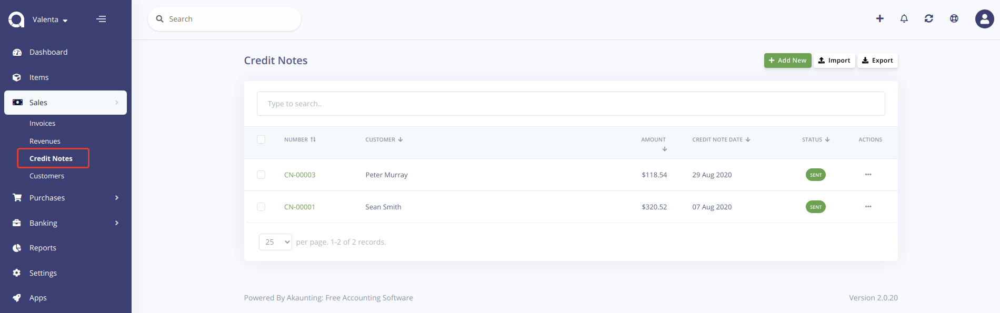

Also, you can quickly create a credit note right from an invoice.

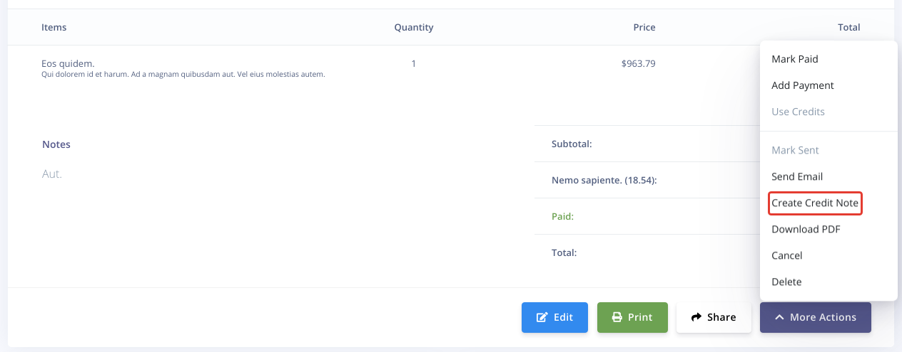

In this case all credit note's fields will be prefilled with the data from the invoice.

Set the Credit Customer Account switch to the appropriate position depending on whether you want to credit a customer's account or make a refund.

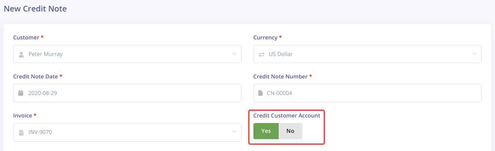

### Using credits

If you set it to the Yes then the credit note's amount will be added to a customer account as credits after a credit note is marked as sent. You can use them to fully or partially paid an invoice.

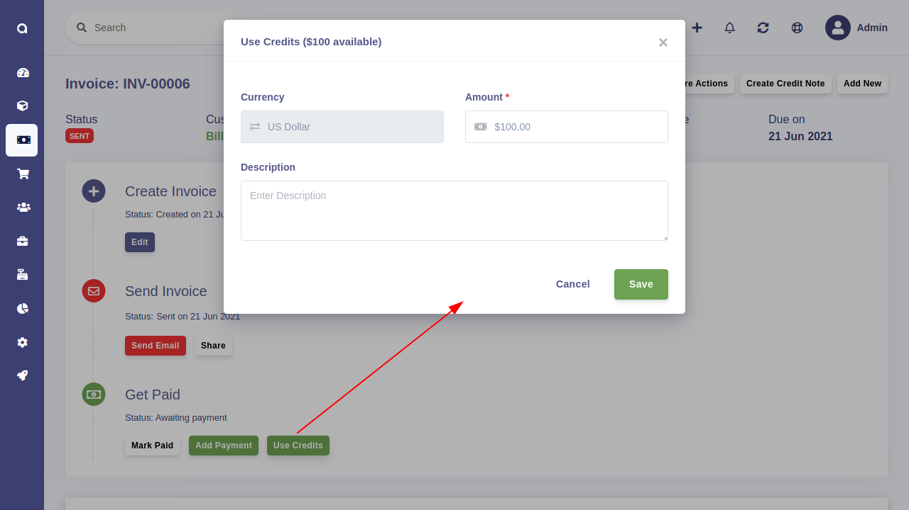

### Making a refund
 
In case you set the Credit Customer Account switch to the No you will be able to refund some amount to a customer. You can use any of available accounts and payment methods to do this.

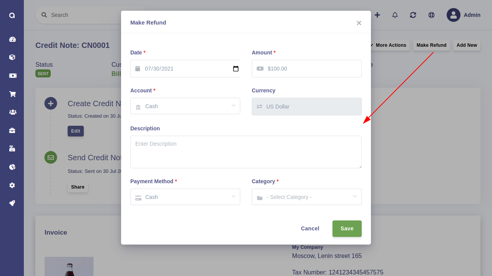

### Customer details
 
The list of credit notes and their total count are also available in the Customer details.

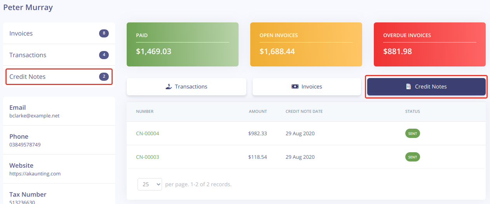

### Settings

You can customize credit note's settings using the standard Akaunting's settings section. Here you can set a number prefix, a number digit, next number, a title, a subheading, notes, a footer text and a template.

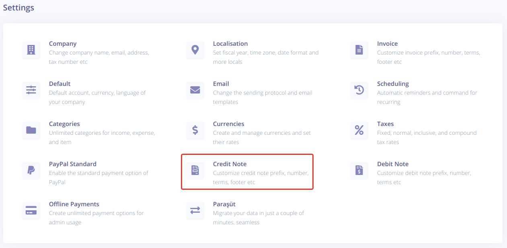

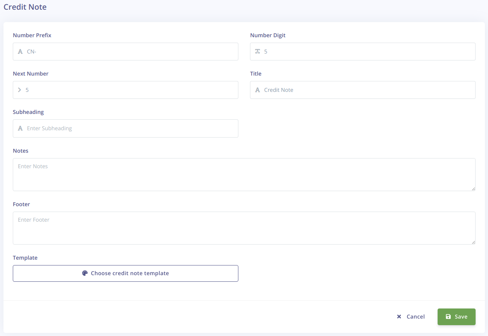

## Working with debit notes

A debit note is a commercial document issued by a customer to a vendor to indicate or request a return of funds due to incorrect or damaged goods received or purchase cancellation.

### Issuing a debit note

After installing the app, a new Debit Notes menu item will be added under the Purchases section. Here you can issue new debit notes.

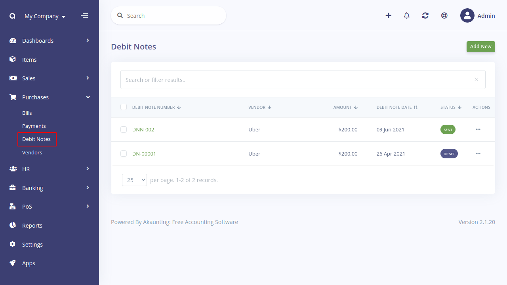

Also, you can quickly create a debit note right from a bill.

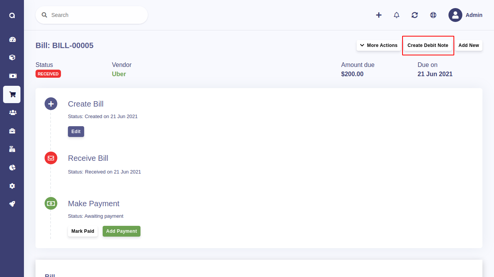

In this case all debit note's fields will be prefilled with the data from the bill.

### Receiving a refund
 
It is possible to receive a refund from a vendor after a debit note is marked as sent. You can use any of available accounts and payment methods to do this.

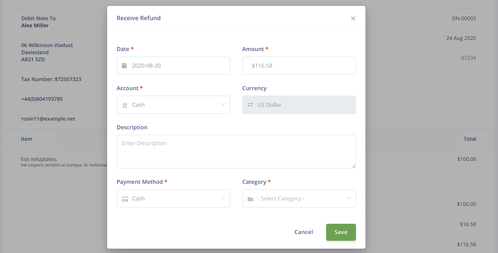

### Settings

You can customize debit note's settings using the standard Akaunting's settings section. Here you can set a number prefix, a number digit, and next number.

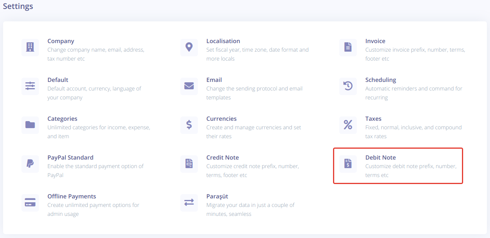

