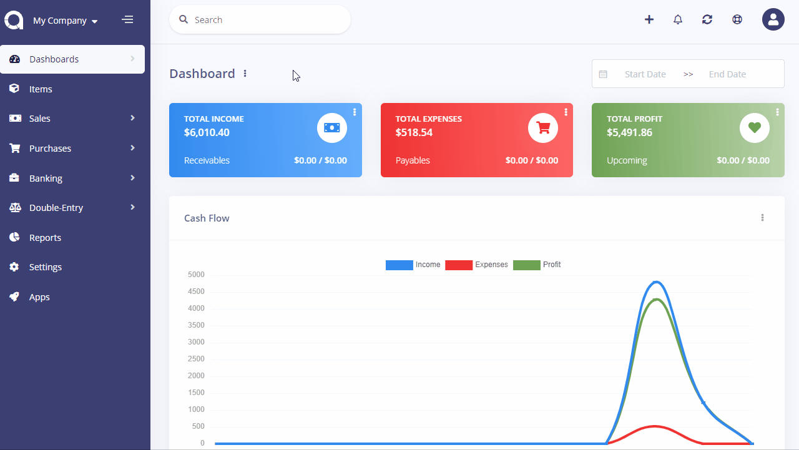
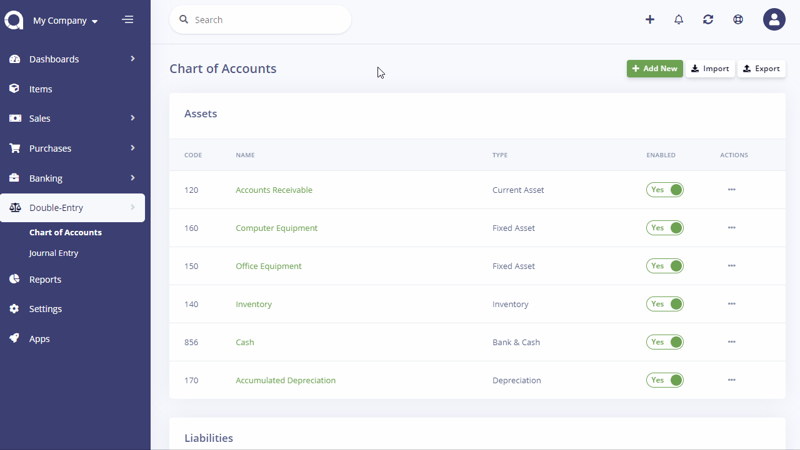
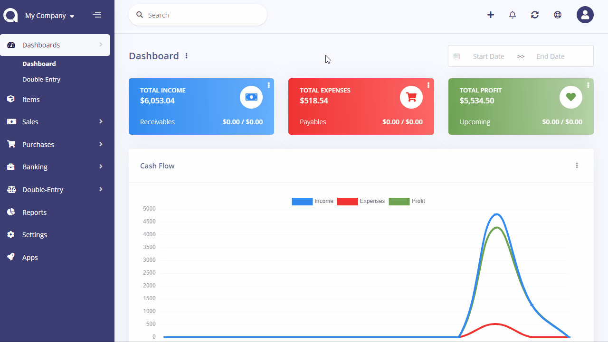

Double-Entry
============

Akaunting ships with single-entry accounting feature set as it's easier to understand for most users. However, some businesses use double-entry accounting to keep their books. [Double-Entry](https://akaunting.com/apps/double-entry) app contains the following features:

- Chart of Accounts
- Journal Entry
- General Ledger
- Balance Sheet
- Trial Balance
- Opening/Starting Balance

## Chart of Accounts

Chart of Accounts page shows account types and its' details. You can see account types, what items they contain, types and ability situations on this page and edit them.

You can add a new account, import your account list or export yours in Akaunting from the menu on top right. To add a new account, just click the "Add New" button on top right. After entering account name, account type, code and description (optional), you can save it by selecting whether it is enable or disable.

In Double-Entry, all categories are collected under these 5 account types.

- Assets
- Liabilities
- Expenses
- Income
- Equity

#### Creating a New Account

You can add a new account easily on the Chart of Accounts page. To do this, click on Add New button on the top right and fill the required fields and then click save.

### Assets

Assets are valuable things that belongs to your business. Assets can contain things like office equipment, properties or Accounts Receivable that your customer owe to your business for the service or product you provide and etc.

### Liabilities

Liabilities shows your business's debts to other parties. It contains things like employee benefits payable, bank payments, tax payments and etc.

### Expenses

Expenses for goods and services used by your business are found in this section. You can find general expenses, legal expenses, rent expenses and etc. in this section, which is very useful for tracking operation costs, or you can tailor it to your needs as in other categories.

### Income

The revenue that you business earn is shown here. It includes items such as revenues from sales and investments etc.

### Equity

Equity shows the net worth of your business by representing the difference between your assets and liabilities. It contains things like owner contribution or owners draw etc.

## Journal Entry

A journal entry is used to record any monetary movement of a business. There are some important steps when creating a journal entry:

- The date of the entry should be entered
- A description should be entered
- Every journal entry should be balanced. It means that the debits and credits have to total to the same amount. Otherwise, it cannot be saved until the credits and debits are matched.

## General Ledger

A general ledger shows all movements of the chart of accounts. It can be printed or exported easily on the General Ledger page. General Ledger widget can be found under the Reports from the menu.

## Balance Sheet

Balance Sheet shows the currents assets, receivables, debts and capital of a business. Balance Sheet widget can be found under the Reports from the menu.

## Trial Balance

Trial Balance shows whether debts and credits are equal or not.

## How to enter the Opening/Starting Balance?

An opening balance is the amount of funds in an account at the beginning of a new fiscal period.

To set the opening balance, create a new entry from **Double-Entry > Journal Entry** page. Select the account for which you're setting the opening balance as first and the **Owner Contribution/Equity** (or an appropriate Equity) account as second. Then:

1. If the opening balance account (first) is an **asset** (i.e. accounts receivable, bank, credit card), enter the amount as a **debit**.

2. If the opening balance account (first) is a **liability** (i.e. accounts payable), enter the amount as a **credit**.

