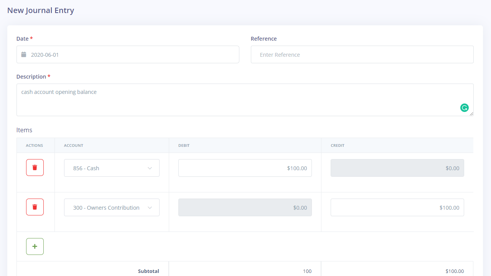

Double-Entry
============

Akaunting ships with single-entry accounting feature set as it's easier to understand for most users. However, some businesses use double-entry accounting to keep their books. [Double-Entry](https://akaunting.com/apps/double-entry) app contains the following features:

- Chart of Accounts
- Journal Entry
- General Ledger
- Balance Sheet
- Trial Balance

### Dashboard and Reports

After installing the app, a new dashboard will be created with widgets according to double-entry accounting so you can ignore/delete the initial dashboard of Akaunting. Keep in mind that Akaunting supports [multiple dashboards](https://akaunting.com/docs/user-manual/dashboard).

The same goes for [reports](https://akaunting.com/docs/user-manual/reports), you should refer to the newly created reports, including the summaries and p&l which are grouped by COA (chart of account).

### How to enter the Opening/Starting Balance?

An opening balance is the amount of funds in an account at the beginning of a new fiscal period.

To set the opening balance, create a new entry from **Double-Entry > Journal Entry** page. Select the account for which you're setting the opening balance as first and the **Owner Contribution/Equity** (or an appropriate Equity) account as second. Then:

1. If the opening balance account (first) is an **asset** (i.e. accounts receivable, bank, credit card), enter the amount as a **debit**.

2. If the opening balance account (first) is a **liability** (i.e. accounts payable), enter the amount as a **credit**.

