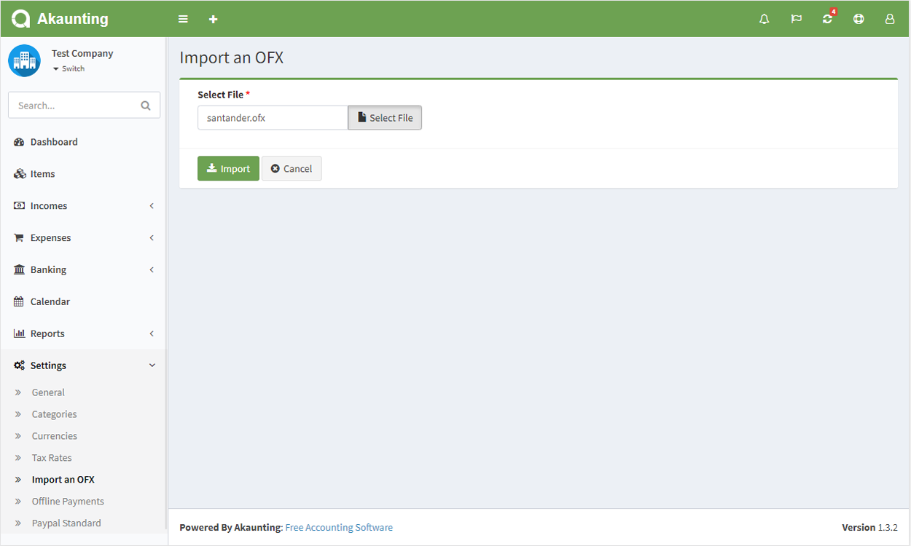
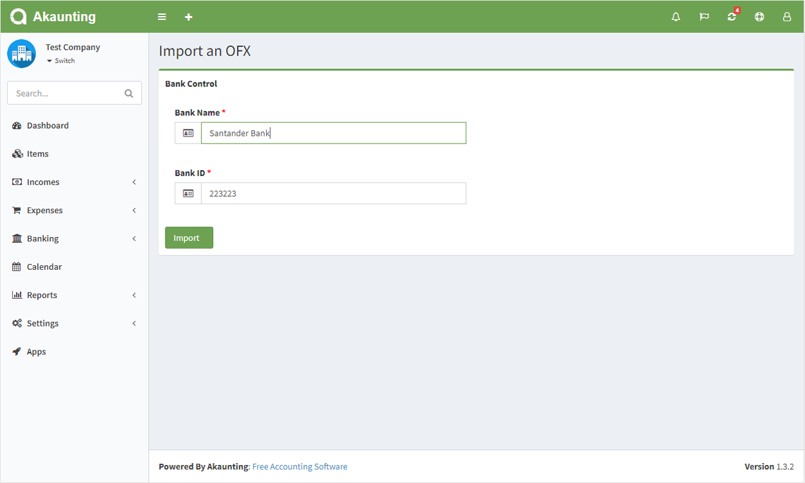
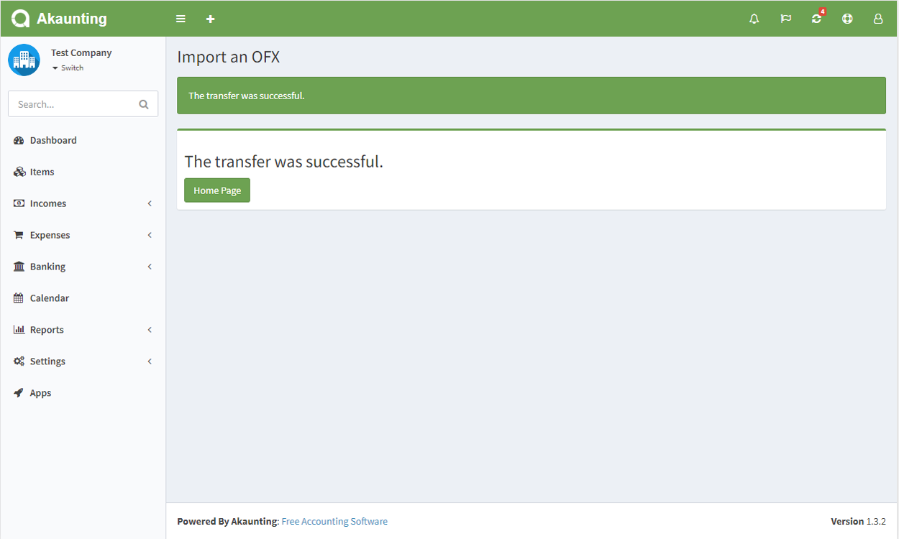

OFX Import
============

**What’s OFX File?** 

An OFX (Open Financial Exchange) file is a text file containing financial data.  

**How to use?**

**Step1:** Buy [Here](https://akaunting.com/apps/ofx) “OFX Import” on Akaunting app store. 

**Step2:** Click Settings -> "Import an OFX" in the left menu. 

**Step3:** The file OFX to be transferred is selected and the press transfer button. 

**Step4:** If the bank name and bank id are present in ofx file: 
- The currency is checked. The currency is automatically added if it is not attached as a currency. 
- If this information is not available, the user is asked to fill in the missing information. 

**Step5:** The record is redirected to the successful page when the transfer is provided. 

**Testing:** Your revenue and payment will be transferred when the transfer is successful. 

