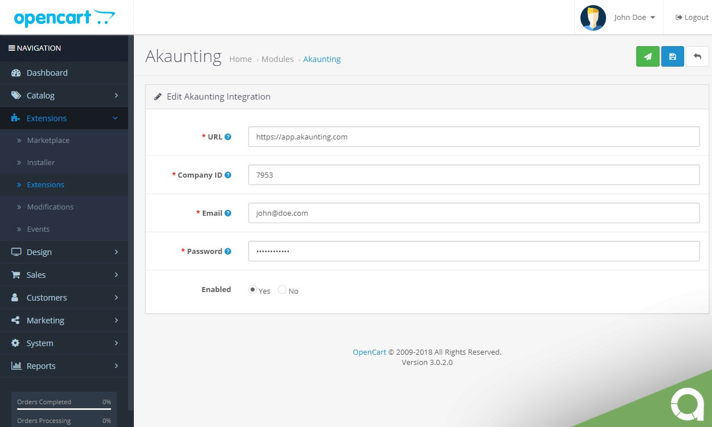

OpenCart
========

This app will sync your current and future OpenCart data (products, customers, orders) with Akaunting.

**URL**: The full path of your Akaunting installation. If you're using our cloud service, then it's https://app.akaunting.com

**Company ID**: You can find it on the [companies](https://akaunting.com/docs/user-manual/companies) page.

**Email & Password**: What you use to login into Akaunting. You can also create a special [user](https://akaunting.com/docs/user-manual/auth/users) just for OpenCart connection.

[Here](https://akaunting.com/apps/opencart) you can get the app and start using it instantly.