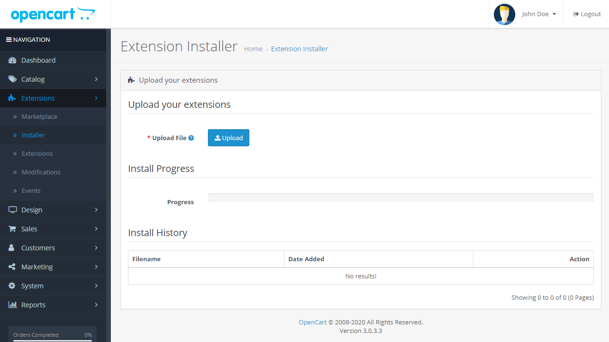
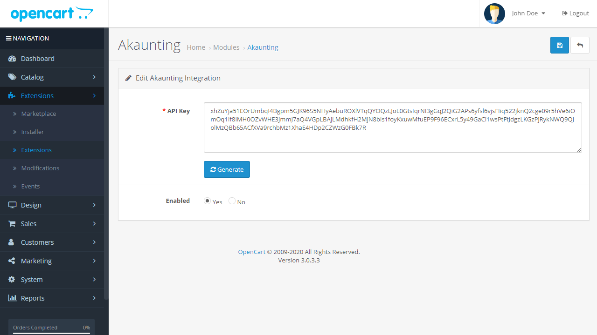
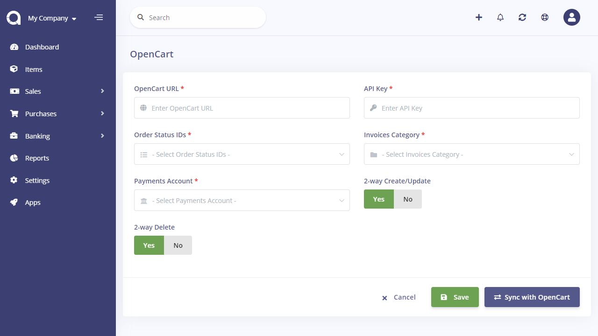

OpenCart
========

This app will sync your current and future OpenCart data (categories, products (items), customers, tax rates, orders) with Akaunting.

Keep in mind that both OpenCart [extension](https://www.opencart.com/index.php?route=marketplace/extension/info&extension_id=32533) and Akaunting [app](https://akaunting.com/apps/opencart) are required in order to have the 2 system talk to each other.

### 1) OpenCart Extension Installation

First of all, after downloding the extension, install it by uploading from *Extensions > Installer* page of your OpenCart. You can also unzip and upload via FTP.

### 2) OpenCart Extension Settings

After installation, go to *Extensions > Extensions* page and filter Modules. In the Akaunting edit page you'll find the API Key to be copy-pasted.

### 3) Akaunting App Settings

Akaunting app will get and send data automatically between Akaunting and OpenCart. In order to get the current data after first installation, you can click on the *Sync Current Data* button. It's not required for future data.

**OpenCart URL**: The full path of your OpenCart installation without wp-admin or wp-login parts. For example: https://my-opencart-domain.com

**API Key**: Generated in the previous step

**Order Status IDs**: The status ids that OpenCart order should have in order to get transferred to Akaunting.

**Invoices Category**: The category that invoices will be assigned to.

**Payments Account**: The bank account that payments will be attached to.

**2-way Create/Update**: Select whether to sync the *create* and *update* actions between Akaunting and OpenCart for categories, products (items), tax rates, and orders. In other words, when a product is created/updated in OpenCart, it will also be created/updated in Akaunting, automatically. Same for vice-versa.

**2-way Delete**: Select whether to sync the *delete* action between Akaunting and OpenCart for categories, products (items), tax rates, and orders. In other words, when a product is deleted in OpenCart, it will also be deleted in Akaunting, automatically. Same for vice-versa.

