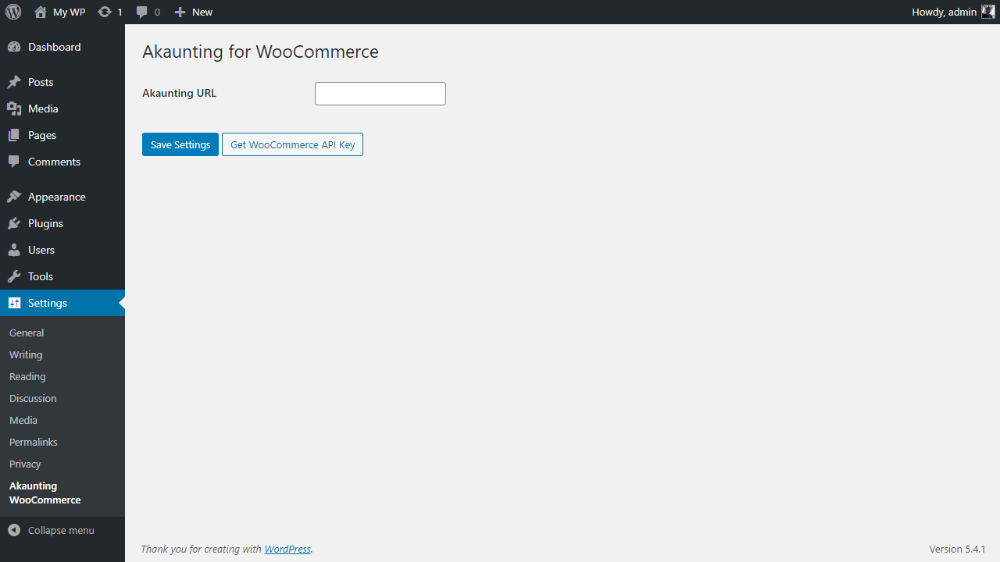
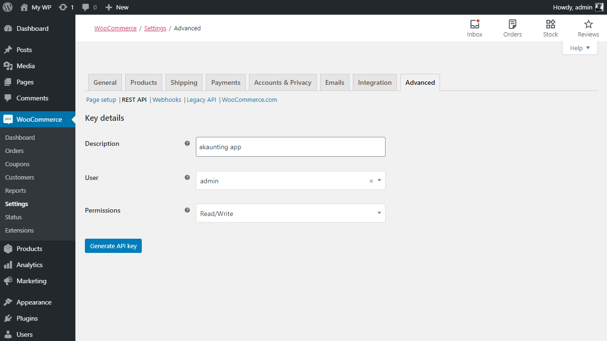
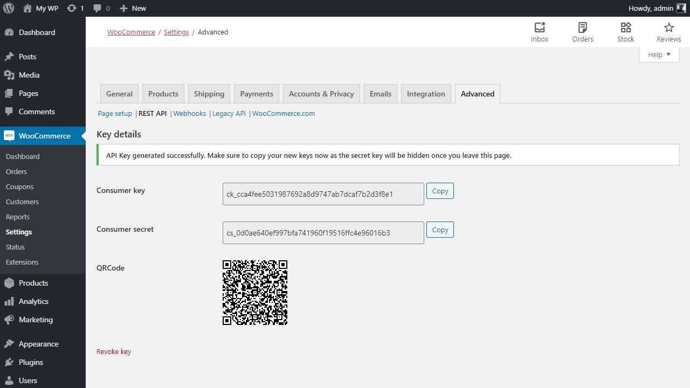
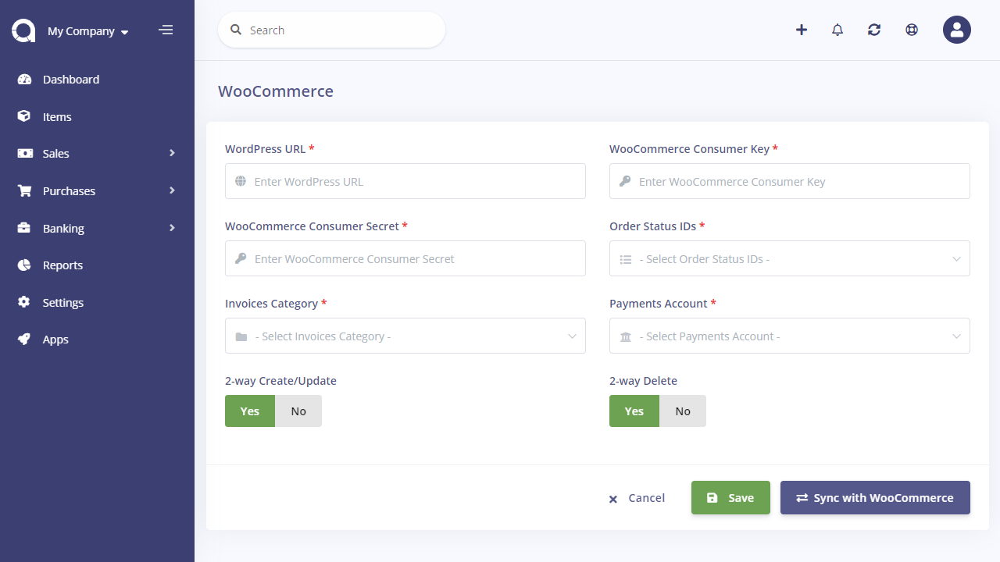

WooCommerce
===========

This app will sync your current and future WooCommerce data (categories, products (items), customers, tax rates, orders) with Akaunting.

Keep in mind that both WordPress [plugin](https://wordpress.org/plugins/akaunting-for-woocommerce) and Akaunting [app](https://akaunting.com/apps/woocommerce) are required in order to have the 2 system talk to each other.

### 1) WordPress Plugin Settings

**Akaunting URL**: The full path of your Akaunting installation. If you're using our cloud service, then it's https://app.akaunting.com

### 2) WooCommerce REST API Keys

After entering the Akaunting URL, you should get the WooCommerce API keys. Make sure you set the **Permissions** as Read/Write.

### 3) Akaunting App Settings

Akaunting app will get and send data automatically between Akaunting and WooCommerce. In order to get the current data after first installation, you can click on the *Sync Current Data* button. It's not required for future data.

**WordPress URL**: The full path of your WordPress installation without wp-admin or wp-login parts. For example: https://my-wordpress-domain.com

**WooCommerce Consumer Key**: Generated in the previous step

**WooCommerce Consumer Secret**: Generated in the previous step

**Order Status IDs**: The status ids that WooCommerce order should have in order to get transferred to Akaunting.

**Invoices Category**: The category that invoices will be assigned to.

**Payments Account**: The bank account that payments will be attached to.

**2-way Create/Update**: Select whether to sync the *create* and *update* actions between Akaunting and WooCommerce for categories, products (items), tax rates, and orders. In other words, when a product is created/updated in WooCommerce, it will also be created/updated in Akaunting, automatically. Same for vice-versa.

**2-way Delete**: Select whether to sync the *delete* action between Akaunting and WooCommerce for categories, products (items), tax rates, and orders. In other words, when a product is deleted in WooCommerce, it will also be deleted in Akaunting, automatically. Same for vice-versa.

