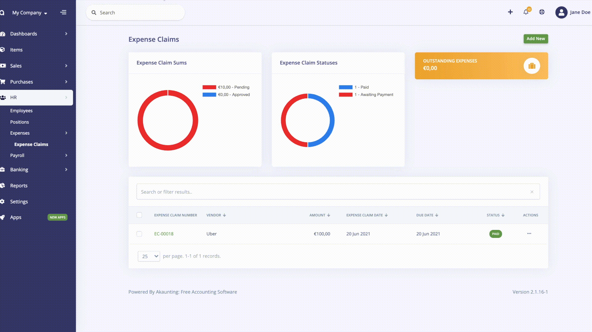
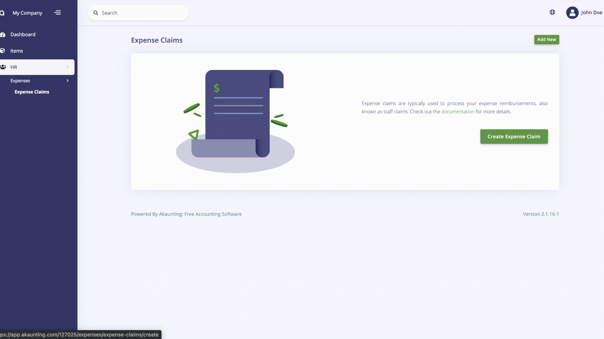

Expenses
============

The Expenses app provides the ability to create, track, and reimburse for expenses incured and paid for on behalf of the company.

Reimbursement is compensation paid by companies to employees for payments made by your employees on behalf of your company. While recording an expense claim, you can pay back reimbursable expenses to your employees such as transportation, travel, food, etc.

The Expense is located under the HR menu, Employee App is also automatically installed when you install Expenses App. To create an expense for an employee first, you should add a new employee. 

The widgets located on the expense page show you all expenses status such as approved, paid, and pending on pie charts. Moreover, the Expense App is fully integrated with Akaunting reports, and you can track employee expenses on the expense reports. You can track the distribution of expenses by adding new expense categories such as transportation, travel, food, etc.

Add New button is located on the top right on the expense page. In order to a new expense claim, you must fill the required fields listed below.

## Features

- Vendor
- Expense Claim Date 
- Expense Claim Number
- Due Date 
- Paid By Employee (to reimburse)
- Employee
- Item
- Category

Moreover, you can add an approver and attach a receipt of the expense.

The admin can create an employee portal, thus employees can view their expense claims and create a new claim for reimbursements. To create an employee portal, the admin should select the ‘Can Login’ while adding a new employee or you can edit created employee. Thanks to the employee portal employees can create their own expense for reimbursement then, the expense shows on the admin portal, the admin can approve or refuse to pay it back to the employee. Employees can create a new item and vendor while adding a new expense claim.

On the settings page, you can adjust expense billing details. 
