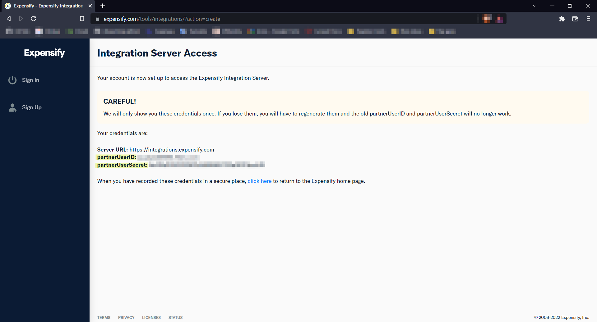
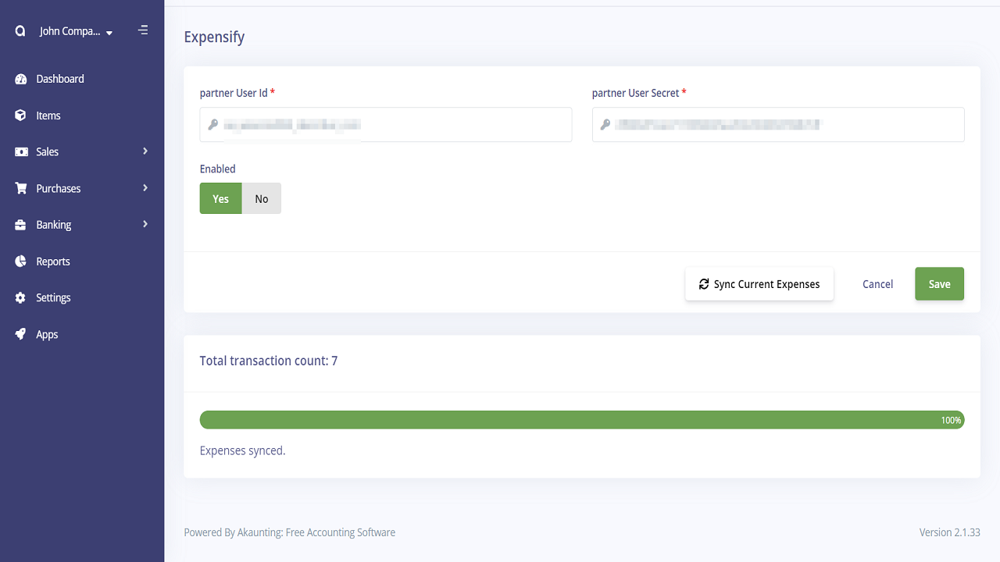

Expensify
==========

**What's Expensify?** 

Expensify is a software company that develops an expense management system for personal and business use.

**How do I integrate Expensify into Akaunting?**

**Step1:** You can access the API credentials by going to this [Link](https://www.expensify.com/tools/integrations/). A pair of credentials: `partnerUserID` and `partnerUserSecret` will be generated and shown on the page.

**Step2:** Go back to Akaunting and Save API credentials from Expensify app's settings then you can sync your current expenses.

