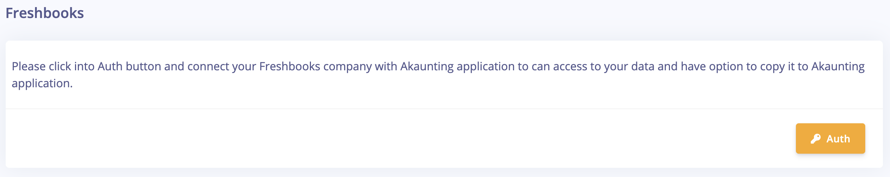
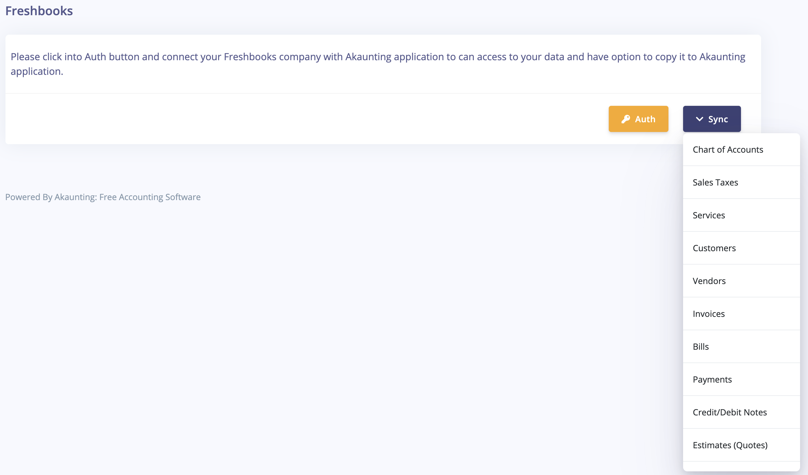

Freshbooks
==========

**What's Freshbooks?** 

Freshbooks is a cloud-based small business accounting software. You can send invoices, track time, manage receipts and expenses.

**How to use?**

**Step1:** Find [Here](https://akaunting.com/apps/freshbooks) "**Freshbooks**" on Akaunting App Store and click _Install_. 

**Step2:** Click Settings then "Freshbooks" in the right menu. 

**Step3:** Connect to your Freshbooks account.

**Step4:** After connect to your Freshbooks account you can select from menu items which data you like to copy from your Freshbooks into Akaunting app.

