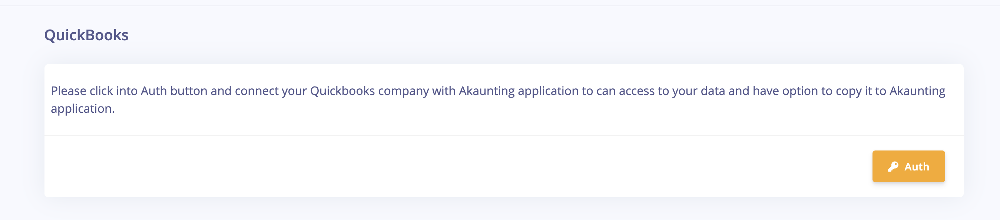
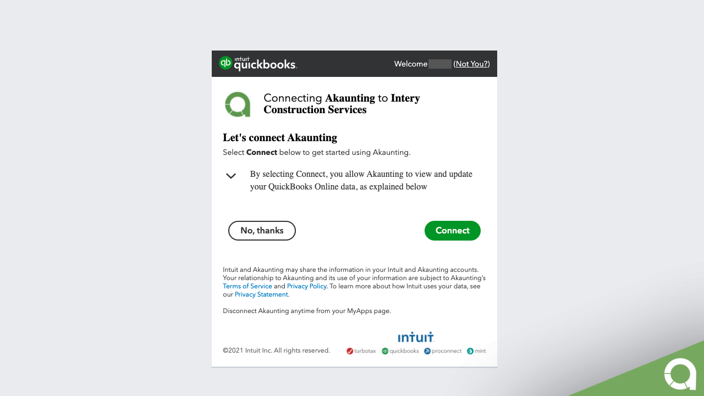
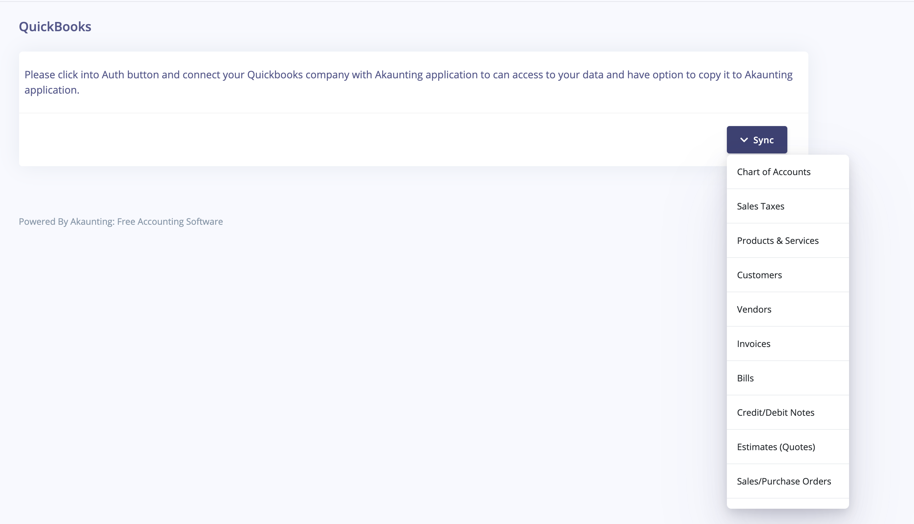

QuickBooks
==========

**What's QuickBooks?** 

QuickBooks is an accounting software package developed and marketed by Intuit. QuickBooks products are geared mainly 
toward small and medium-sized businesses and offer on-premises accounting applications as well as cloud-based 
versions that accept business payments, manage and pay bills, and payroll functions.

**How to use?**

**Step1:** Find [Here](https://akaunting.com/apps/quickbooks) "**QuickBooks**" on Akaunting App Store and click _Install_. 

**Step2:** Click Settings then "QuickBooks" in the right menu. 

**Step3:** Connect to your Qucikbooks account.

**Step4:** After connect to your QuickBooks account you can select from menu items which data you like to copy from your QuickBooks into Akaunting app.

