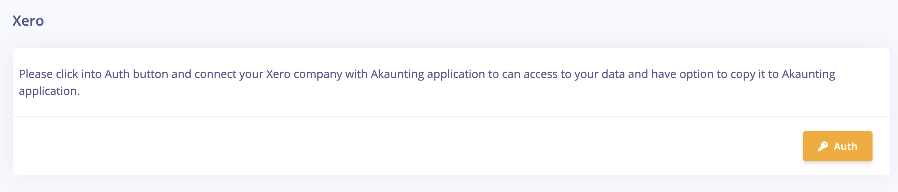
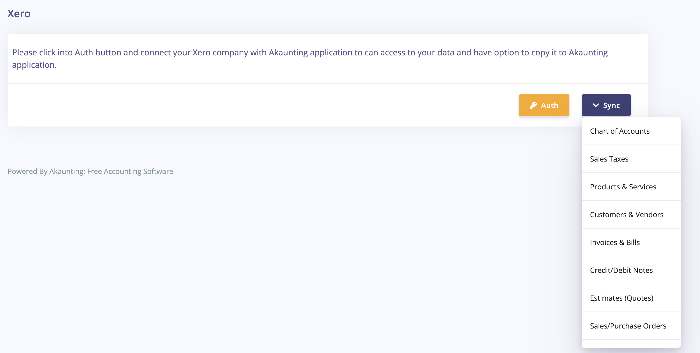

Xero
==========

**What's Xero?** 

Xero online accounting software for your business connects you to your bank, accountant, bookkeeper, and other business apps.

**How to use?**

**Step1:** Find [Here](https://akaunting.com/apps/xero) "**Xero**" on Akaunting app store and click _Install_. 

**Step2:** Click Settings then click on "Xero" in the right menu. 

**Step3:** Connect to your Xero account.

**Step4:** After connect to your Xero account you can select from menu items which data you like to copy from your Xero into Akaunting app.

## Need a custom functionality

Need a custom functionality in [Akaunting](https://akaunting.com), or want to develop a new feature, feel free to email us on stojan.kukrika@gmail.com.
