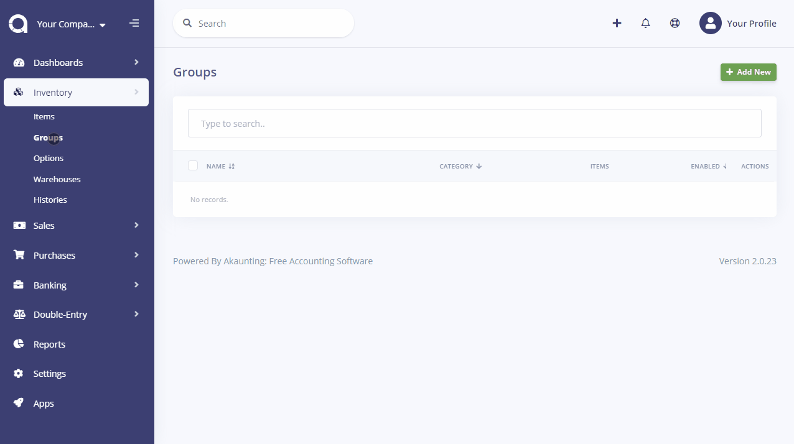
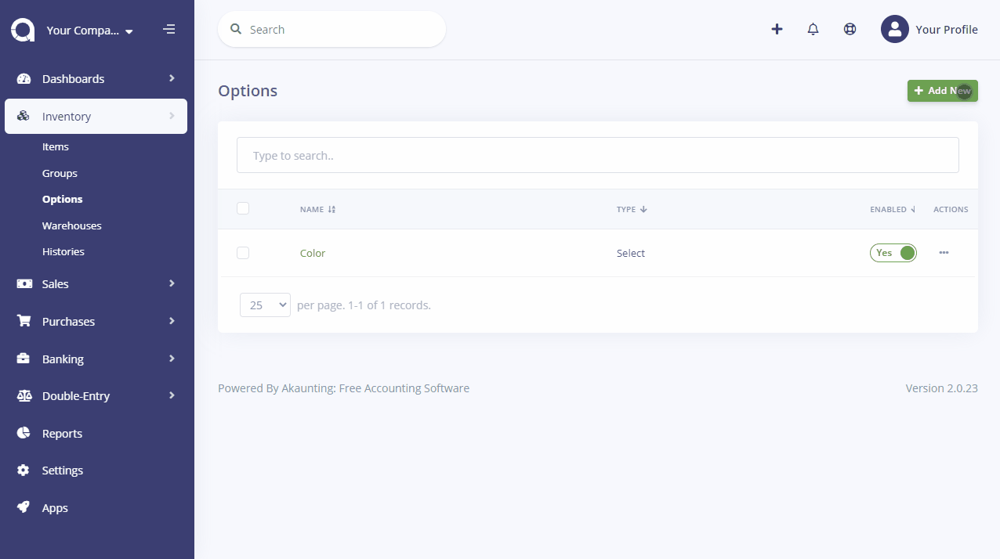
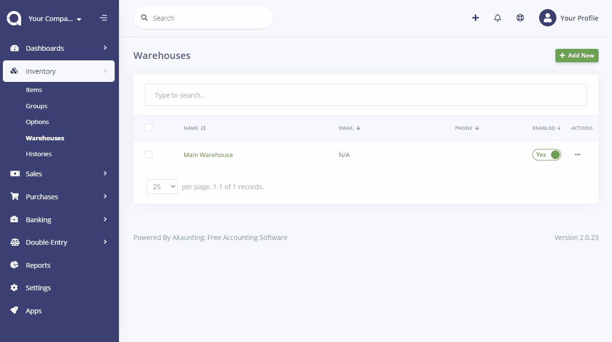

Inventory
=========

Inventory is an app for you to do advanced inventory management. You can take control of your inventory with features like composite items, item groups, packages, shipments and bulk adjustments.

### Items

In Items section, you can add new items, import your ready-to-use lists or export your items lists.

### Groups

In Groups section, you can manage your items that can be considered under the same group. You can select options, add new items and manage their details from groups.

For example, if you have a fashion business, you may have groups like T-shirts, Jeans, Jackets and so on. You can group them under this section and add options such as like size, color and etc. To be able to add options, you need to add options first under the options section. Also with the reorder field, you’ll be notified when your stock is under that amount.

### Options

In Options section, you can add, manage options which describe your items better.

### Warehouse

In this section, you can add, manage warehouses you work with. You can also see their details, items which are coming from them and edit them.

### Histories

In Histories section, you can see your item history, which warehouse they are coming from and their quantity.
