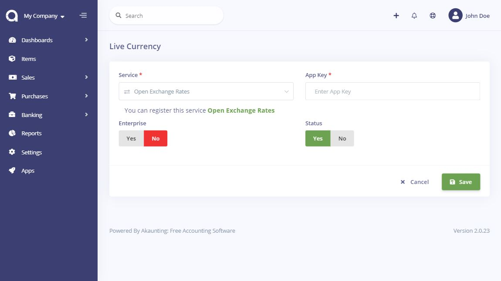
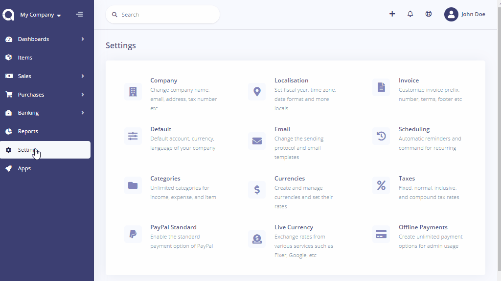

Live Currency
=========

This app allows you to retrieve live currency exchange rates from various services such as Fixer, Open Exchange Rates, Google and a lot more and save them into Akaunting, automatically. Don't waste your time updating currencies manually, Live Currency will sync the rates for you.

You can set the service you want to use with Live Currency on Settings > Live Currency page.

Once you've set that up, it will automatically sync currencies based on the service that you're using, once a day. However, when you need to sync currencies instantly, you can always do it by using Sync button on Settings > Currencies page.

Here is the list of the available services:

| Service	| Base Currency |	Quote Currency |
| ----------- | ----------- | -----------  |
| Fixer |	EUR (free, no SSL), * (paid) |	* |
| currencylayer |	USD (free), * (paid) |	* |
| European Central Bank |	EUR	| * |
| National Bank of Romania |	RON	| * |
| Central Bank of Turkey |	*	| TRY |
| Central Bank of Czechia |	* |	CZK |
| Central Bank of Russia |	*	| RUB |
| WebserviceX |	* |	* |
| 1Forge |	* (free but limited or paid) |	* (free but limited or paid) |
| Cryptonator |	* Crypto (Limited standard currencies) |	* Crypto (Limited standard currencies) |
| CurrencyDataFeed	| * (free but limited or paid)	| * (free but limited or paid) |
| Open Exchange Rates |	USD (free), * (paid) |	* |
| Xignite |	* |	* |
| Currency Converter API |	* |	* |

\* means all currencies

