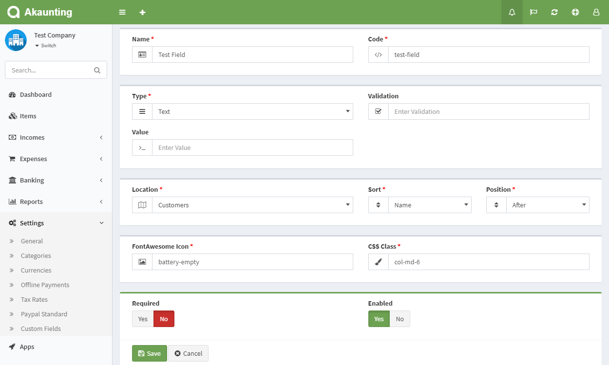

Custom Fields
=============

The custom fields app allows you to add unlimited fields anywhere.

**Name**: Field name.

**Code**: A unique word to be used by the system to map the field with other pages.

**Type**: The type of the field. There are 8 different field types at the moment:

- Text
- Text Area
- Select Box
- Checkbox
- Radio Button
- Date
- Time
- Date & Time

**Validation**: You can enter any validation rule available here [here](https://laravel.com/docs/validation#available-validation-rules). For example, *integer* if you want to be able to enter only numbers.

**Value**: The default value or values list based on the selected type.

**Location**: In which page you want to show the field.

**Sort & Position**: Before/After which field you want to show the custom field.

**FontAwesome Icon**: The icon to be shown in the form. [Here](https://adminlte.io/themes/AdminLTE/pages/UI/icons.html) you can find the list. *Don't* add the **fa-** prefix.

**CSS Class**: You can add any class available within the [AdminLTE](https://adminlte.io/themes/AdminLTE/index2.html) theme but generally the [Boostrap grid](https://getbootstrap.com/docs/3.3/examples/grid/) is used..

[Here](https://akaunting.com/apps/custom-fields) you can get the app and start using it instantly.
