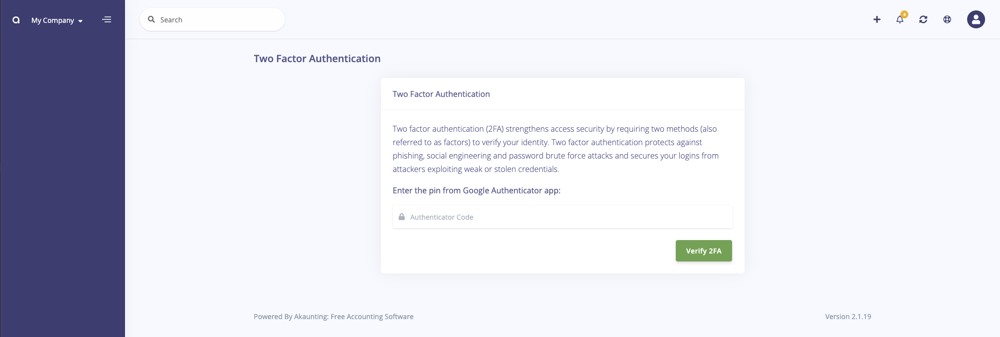
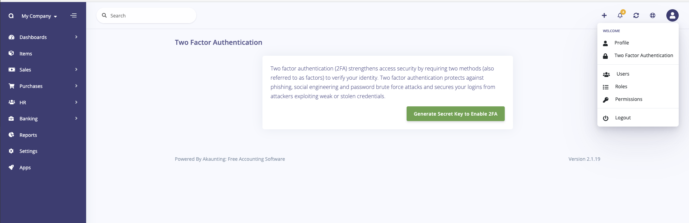
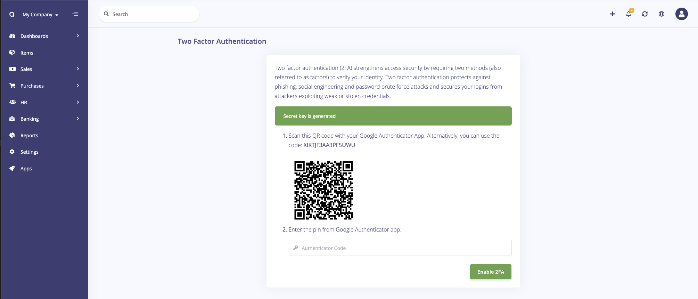

Two Factor Auth
===============

Two factor authentication (2FA) strengthens access security by requiring two methods (also referred to as factors) to verify your identity. Two factor authentication protects against phishing, social engineering and password brute force attacks and secures your logins from attackers exploiting weak or stolen credentials.

This addon presents the following screen once activated and configured to protect your user account.

## Installation

Install the app within one click from your **Akaunting > Apps > XXX** page then go to **Profile > Two Factor Authentication** page.

Click the `Generate Secret Key to Enable 2FA` button to enable it for your user account.

Scan then enter the code and Enable. In future you will now be required to enter the code every time you login to the account.
