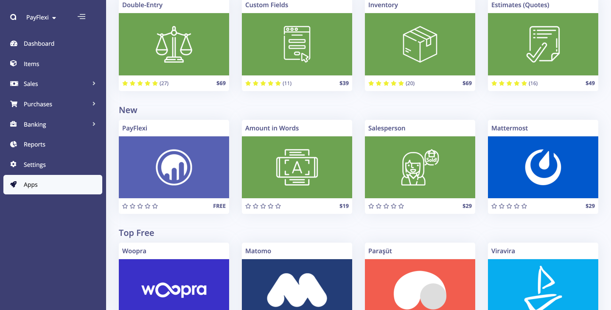
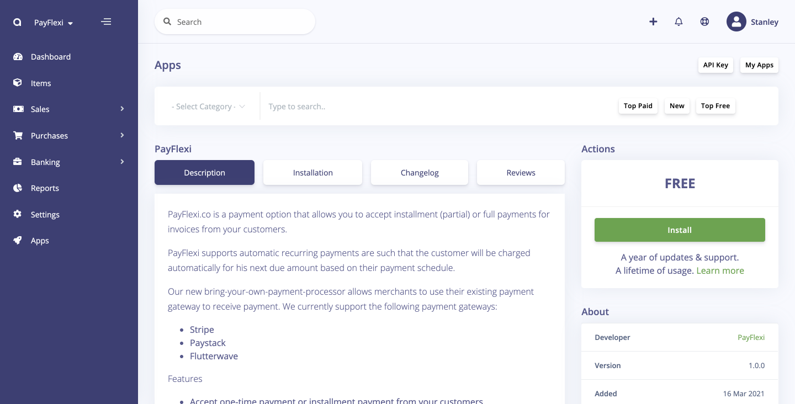
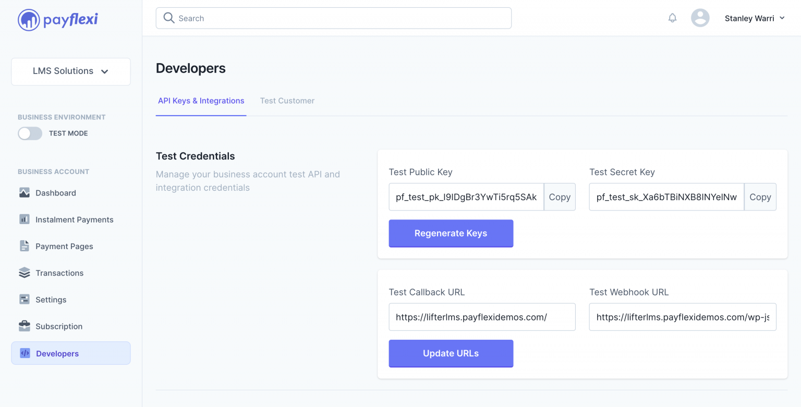
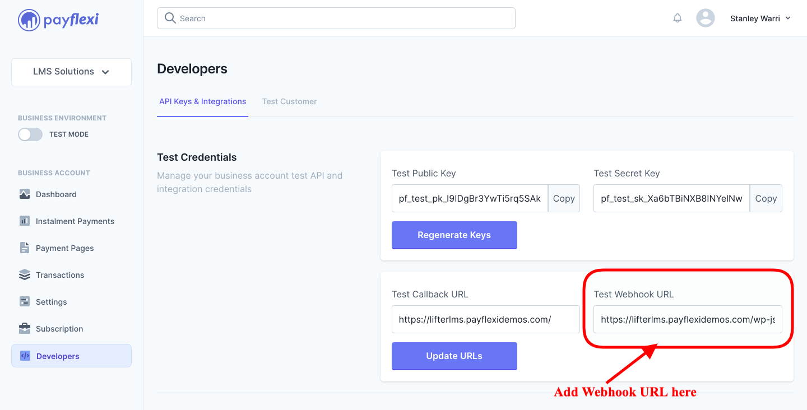
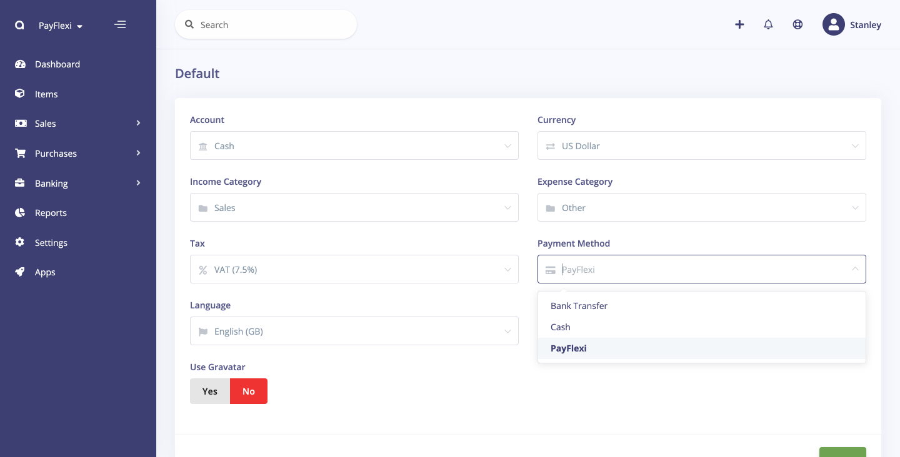
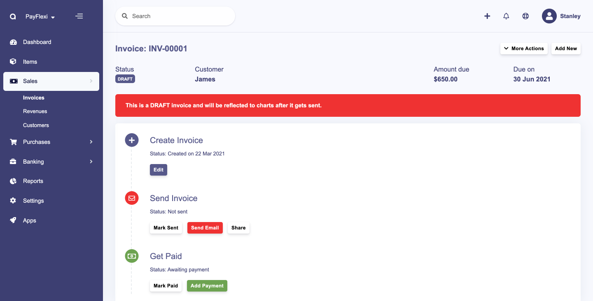
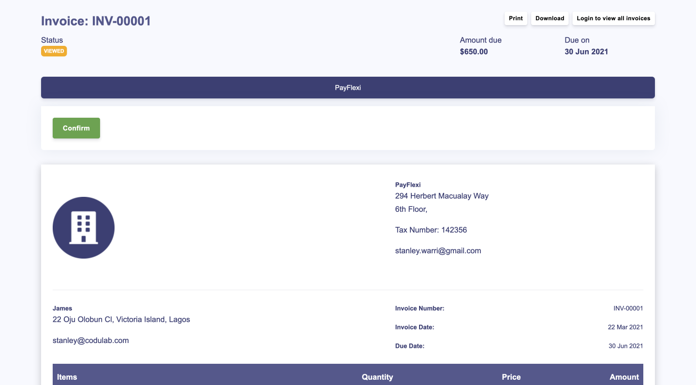
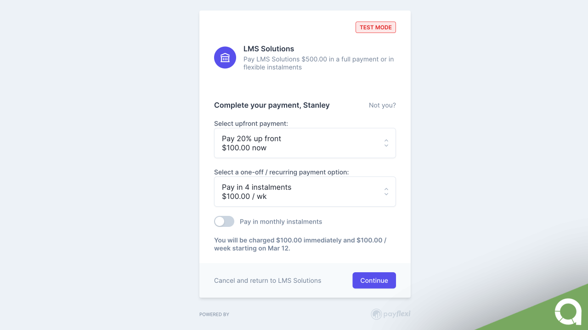

PayFlexi
======

> [PayFlexi](https://payflexi.co) is a payment method that allows you to accept instalment (partial) or full payments for invoices from your customers.

PayFlexi supports automatic recurring payments are such that the customer will be charged automatically for his next due amount based on their payment plans.

Our new bring-your-own-payment-processor allows merchants to use their existing payment gateway to receive payment. We currently support the following payment gateways:

__[Stripe](https://stripe.com)__
__[Paystack](https://paystack.com)__
__[Flutterwave](https://flutterwave.com)__

## Installation

To integrate PayFlexi with Akaunting, you can sign up for a free cloud account on [Akaunting](https://akaunting.com/dashboard)

After setting up your account, click on Apps menu and search for PayFlexi. To learn more on how to set up your Akaunting dashboard, click [here](https://akaunting.com/docs/user-manual/dashboard)

Click on the “PayFlexi” card to view and then click on the “Install” button

## Settings

After installing, click on the **Settings** menu and click on **PayFlexi** card

* __Test Secret API Key__ – Enter your Test Secret Key here. Get your API keys from your PayFlexi Merchant Account under Developer > API
* __Test Public API Key__ – Enter your Test Public Key here. Get your API keys from your PayFlexi Merchant Account under Developer > API
* __Live Secret API Key__ – Enter your Live Secret Key here. Get your API keys from your PayFlexi Merchant Account under Developer > API
* __Live Public API Key__ – Enter your Live Public Key here. Get your API keys from your PayFlexi Merchant Account under Developer > API
* __Webhook URL__ – This is automatically generated for you. Copy it and add it to the webhook url field on your PayFlexi merchant dashbaord and click on update URL.

Next, you add your API keys from your PayFlexi merchant dashboard.  If you don’t have a merchant account, you can register for a merchant account by clicking [here](https://merchant.payflexi.co/)

Then navigate to **Developers > API Keys** menu on your PayFlexi dashboard. Copy your keys from this page to your Akaunting PayFlexi Settings page

### Setup Webhook URL

<strong>You have to set the Webhook URL in the [API Keys & Webhooks](https://merchant.payflexi.co/developers?tab=api-keys-integrations) settings page in your PayFlexi Merchant Account</strong>

Copy the Webhook URL from your Akaunting PayFlexi Settings page.

Once you’re done, you can click on __Save__.

## General Configuration

Under your Akaunting **Settings**, you can click on the **Default** card and select **PayFlexi** as the default payment method.

After creating your invoice, click on **Send Email** to send it to the customer for payment

The customer will receive an email with a link to make payment.

On clicking **Confirm**, it redirects your customers to PayFlexi to set up their payment plans.

### Useful Resources

* Learn how to setup your Stripe account - [Click Here](https://support.payflexi.co/collections/how-to-connect-your-stripe-account/)

* Learn  how to test your integration by following this instruction [here](https://support.payflexi.co/collections/how-to-test-payments-on-payflexi/)

