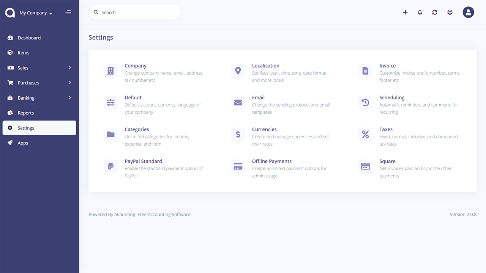
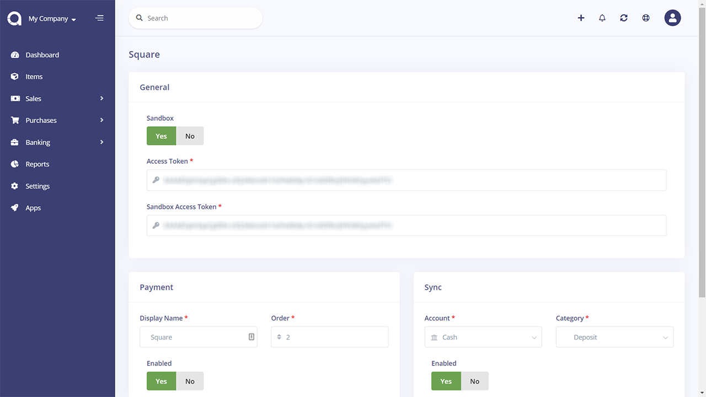

Square
======

> Secure payment processing for your invoices

## Installation

Install the app within one click from your **Akaunting > Apps > Square** page then go to **Settings > Square** page.

## Settings

From this page, you can update the required settings for your app.

### General

In General Box, you can enable and disable the sandbox (the sandbox is for testing the payment system).

> In a live site, the sandbox option should be disabled.

**Access Token** - You can get the Access token from [Square](https://squareup.com/us/en) Payment site, there are two types of access tokens: the first one is for production mode, and another one is for testing(sandbox) mode.

If Sandbox is enabled, the app will use test access token else production access token.

### Payment

In this section, you can update payment mode visibility.

**Display Name:** this name will be displayed to the customer when they select a payment method to pay an invoice.

**Order:** You can choose the order of your payment method name in the customer payment method select dropdown.

**Enabled:** You can enable/disable payment options from here.

### Sync

In this section, you can manage the sync functionality of the Square App. From here, you can manually sync your payments from Square to Akaunting invoices.
