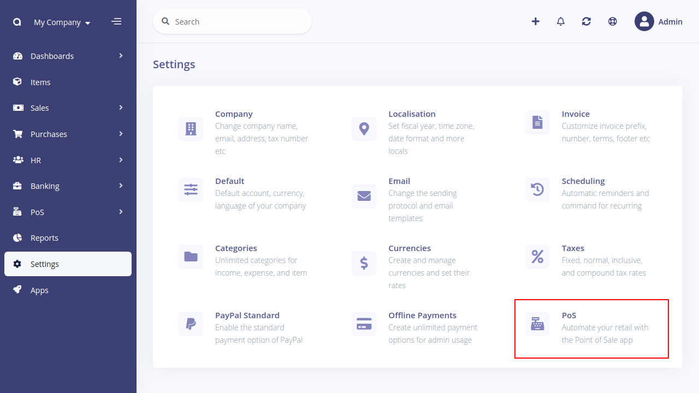
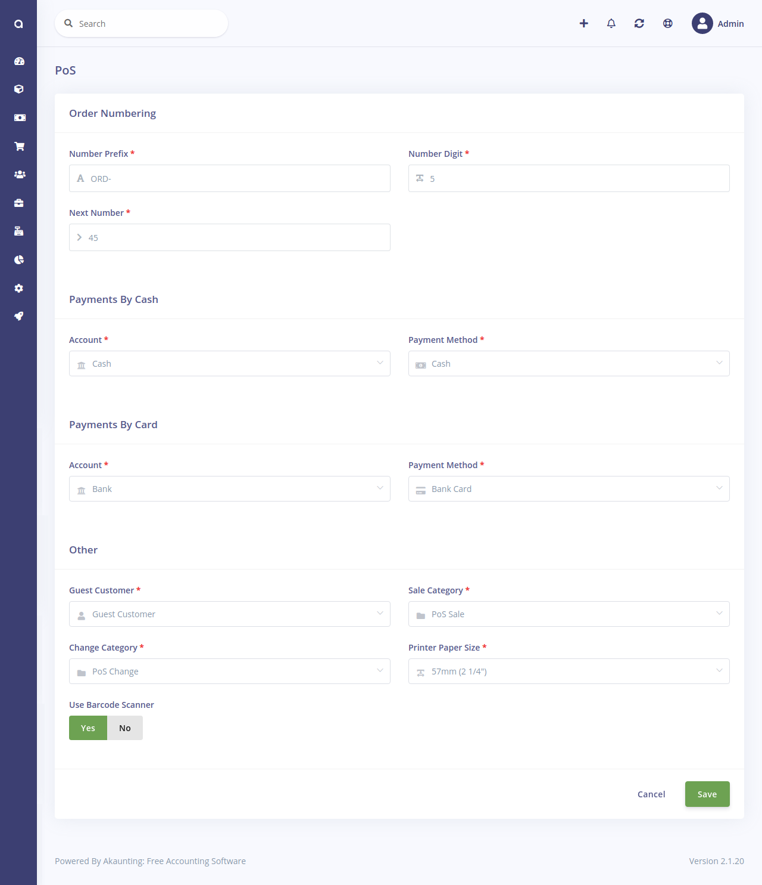
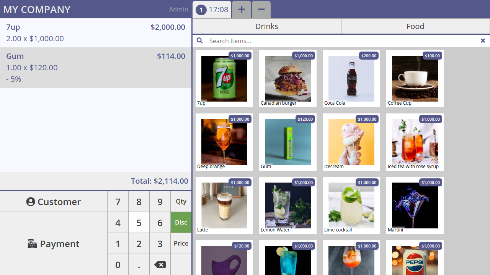
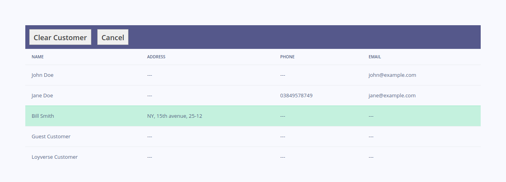
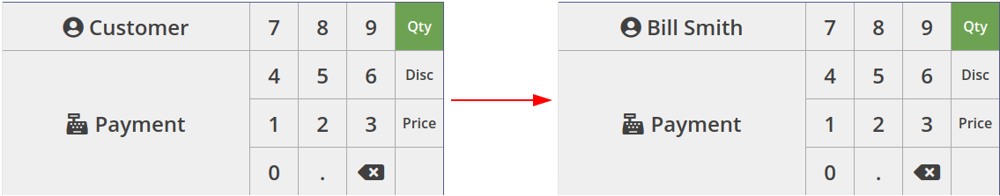
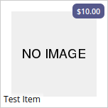
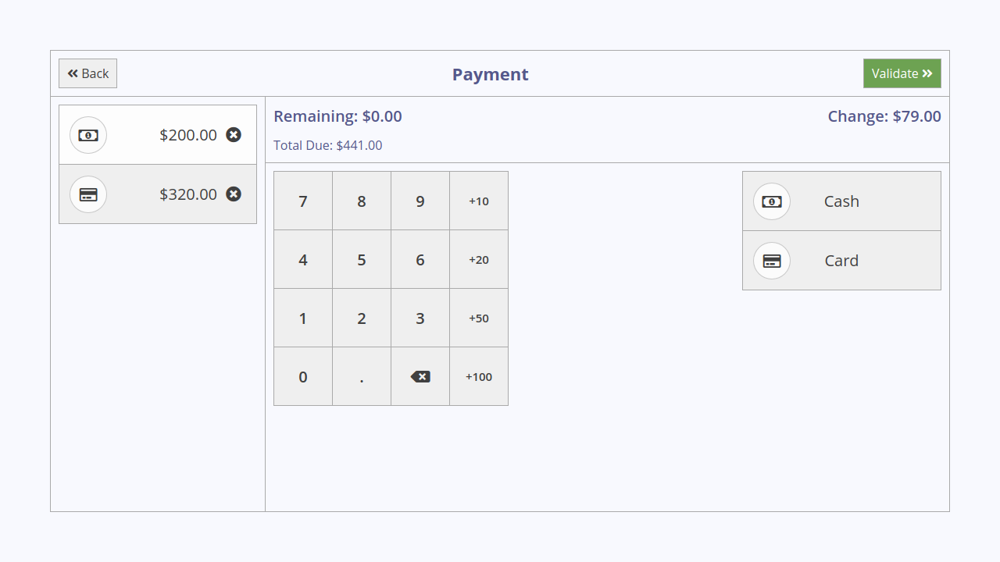
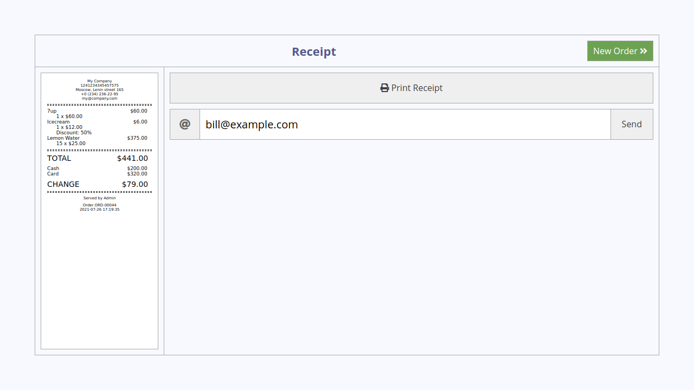
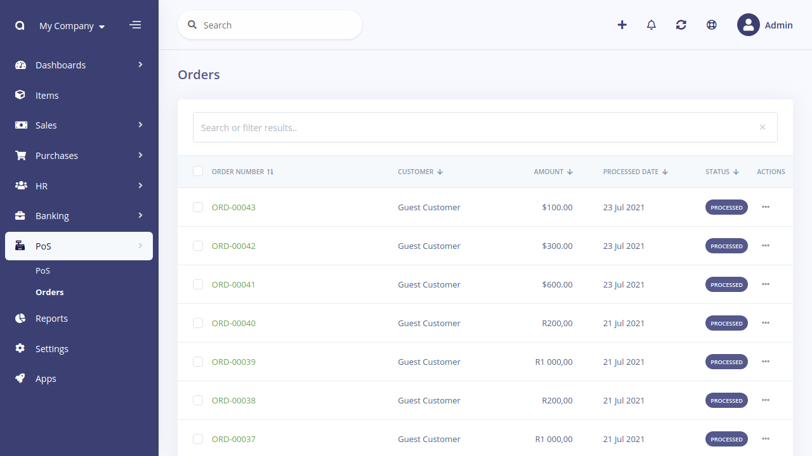
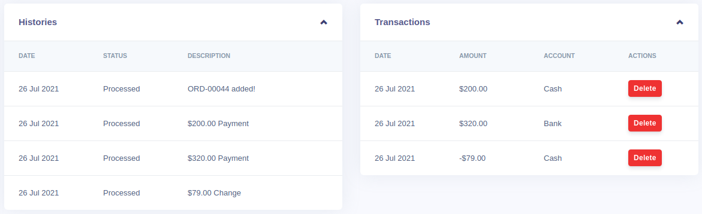

Point of Sale
=============

[Point of Sale](https://akaunting.com/apps/pos) app allows to:

- Select a customer for an order
- Serve multiple customers at the same time
- Receive payment using multiple payment methods in one order
- Apply discount
- Print a receipt or send an electronic receipt by email
- Track processed orders

## Starting using the Point of Sale app

It is advised to start by checking the PoS settings. Make sure that all settings fit your needs. If you are not sure with any setting - leave it as is, with the default value.

### Available settings

**Prefix** added to each order's number before digits making the number look like ORD-00001.

**Number of digits** in an order's number. 5 digits will make an order number look like ORD-00199, and 6 digits will generate numbers like ORD-000345. Add as many digits as you need, but 5 should be enough in most cases.

**Next order number** is used to set the number of the next order. It will be incremented automatically, but you can adjust it in case of deleted order or any other case.

**Account and payment method** for payments made by cash are used for income transactions for cash payments.

**Account and payment method** for payments made by card are used for income transactions for card payments.

**Guest customer** is a customer that is used in a payment transaction if you don't select a customer for an order.

**Sale category** is used in an income transaction created for payment.

**Change category** is used in an expense transaction created for a change.

**Printer paper size** allows you to adjust a receipt's size to your printer's paper width.

**Paper cutter usage** switch if enabled, will make a receipt having a page break below all the content. Most receipt printers use the page break as a command to cut the paper.

**Barcode scanner usage** switch controls the search field behavior. When it is set to "Yes", then the search field will automatically get focus, allowing you to scan goods sequentially, one by one.

## Working in PoS interface

The main PoS screen consists of 5 sections:

- Order's "basket"
- Numeric keypad
- Orders tabs
- Categories
- Items

Also, there are screens for receiving payment and for printing a receipt.

### Basket

It is a list of all items added to the current order. It shows their quantity, price, discount, and sum. Also, it calculates the order's total sum.

The last added item is highlighted by grey color. You can select another item by clicking on it. Quantity, price, and discount of the selected item can be adjusted using the numeric keypad.

### Numeric keypad

Numpad serves 3 goals at once - it allows you to select a customer for an order, switch to receiving a payment from a customer, and quickly adjust a quantity, price, and discount for items added in the order.

#### Selecting a customer

Press the `Customer` button to select or clear the customer for an order. You will see a list of registered customers. Already selected customer is highlighted by green color.

Clicking on any row will select that customer and return to the main PoS screen. The `Clear Customer` button deselects the current customer making order have no customer selected.

The name of the current customer is displayed in the Numpad:

#### Adjusting the order items

The right part of the Numpad contains numeric buttons from `0` to `9`, `.` button for decimal point, `delete` button, and radio buttons for mode selection. There are 3 modes: `quantity`, `discount`, `price`. The result of pressing other buttons depends on the current mode. The current mode can be identified by green color on one of the "mode" radio buttons.

You may use a physical numpad on your computer keyboard as well as buttons of the onscreen Numpad.

`Quantity` mode allows you to change the quantity of the selected item. The first press of a numeric button immediately changes the quantity. Let's say the selected item has the quantity of "1", then pressing the `5` button will change it to "5". Subsequent presses of numeric buttons will add numbers to the quantity. So, in the above case, pressing the `1` button will change the quantity to "51". Pressing the `.` and `2` buttons will change the quantity to "51.2". The `delete` button clears the last number. When the quantity is equal to zero, pressing the `delete` button will remove the selected item from an order.

In the `Discount` mode you add or reduce/remove a discount (in percents) for the selected item. The discount can't be more than 100%, so if you exceed this amount, then the discount will be automatically set to 100%.

Using the `Price` mode you control the price of the selected item. There are no restrictions on how big or small a price can be, so pressing the `delete` button when the price is zero won't remove the selected item from an order.  

### Orders tabs

The `Orders tabs` section contains a tab for each unprocessed order and buttons for creating a new order and closing a current order.

Each tab shows the time when an order was created. The current order's tab is highlighted by light grey color. You may switch between orders by clicking on their tabs. A number on the left side of each tab shows a serial number of an order, and counting begins when a PoS session starts.

### Categories

The `Categories` section shows all categories your goods belong to and allow you to filter goods by clicking on a category.

Clicking on the "home" button here will reset the filtering, and you'll see all your goods again.

### Items

Your goods are shown in the `Items` section as rectangles that contain the price, name, and image of an item. If you don't provide an image, then a placeholder image will be used.

Clicking on a rectangle adds an item in an order. If there is already such an item in an order, then its quantity will be incremented by 1. Thus, you can successively click on an item as many times as you want to add it.

Items section also provides a search field that searches for your input in items' name, description, SKU, and barcode. When items are filtered by a category, a search will include only items that belong to that category. You may press the `Enter` key when you found a single item, and it will be added to an order. This works similar to clicking on an item and speeds up a process. If you use a barcode scanner, it will do that for you automatically, so you'll be able to scan products one by one without even using a keyboard. The `X` button clears an entered text.

### Receiving a payment

Clicking the `Payment` button in the Numpad will open a screen for receiving payment for an order.

This screen automatically calculates the total due, remaining amount, and change. Using the `Cash` and `Card` buttons you can add as many payments as a customer wants. The newly added payment will have an amount equal to the remaining amount. By clicking on a payment you select it and make it available for adjusting using a Numpad. The current payment is highlighted in white color. Payment can be deleted by pressing the `X` symbol on its right side.

At any time you may press the `Back` button and return to the main PoS screen. This is helpful in cases when a customer wants to add something to the order at the last moment or when a customer asks you to postpone the order for a while. After you return to the main PoS screen, you may adjust the current order or serve the next customer in line.

When you add enough payments, you'll see the `Validate` button changing its color to green. You confirm the payment by clicking on it and proceed to the `Receipt` screen.

### Printing a receipt

`Receipt` screen shows a preview of a receipt and also allows you to print it and send it by email. If you selected a customer for an order and that customer has an email, then the `email` field will be automatically filled. Of course, you may provide any other valid email address here.

After printing or/and sending a receipt, click the `New Order` button and return to the main PoS screen with a fresh new order awaiting you.

## Back office

Front and back office are terms used to refer to various business processes within a company where revenue-driving and customer-facing activities are called "front office", and all the backend processes such as accounting and analysis are called "back office".

All processed orders are available from the `Orders` menu item under the `PoS` dropdown menu.

There you can cancel and delete any order, and also see its details. In the footer of an order details page you may find all its transactions.

