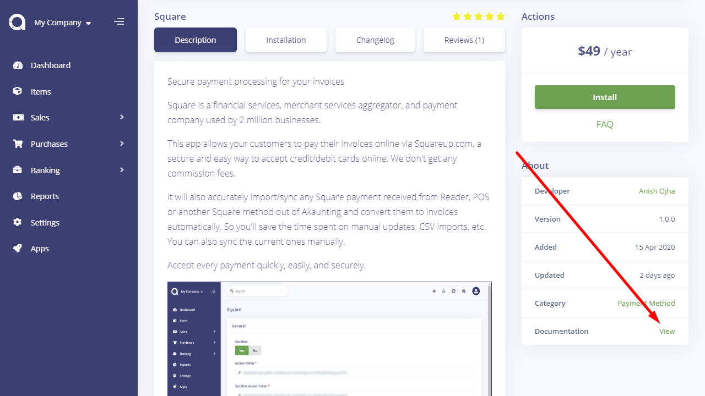
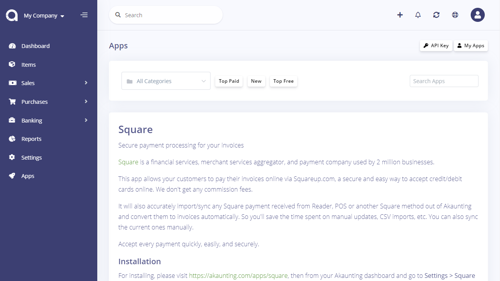

Adding Documentation
====================

Akaunting documentation is not only for its core features but also for apps. The documentation of apps will be shown both on this site and embed into Akaunting itself.

### Menu

As mentioned in the [README](https://github.com/akaunting/docs) file, the menu file contains the navigation structure of the documentation. You should add your app under its respective category.

### File

After adding to menu, you should create a file under the respective folder. If there is no such a folder, feel free to create it. Screenshots can be placed into the *_images* folder.

Check out this [commit](https://github.com/akaunting/docs/commit/01af4d5f4788a812bf8865e8008bf9fd8579b4ab) as a live example.
