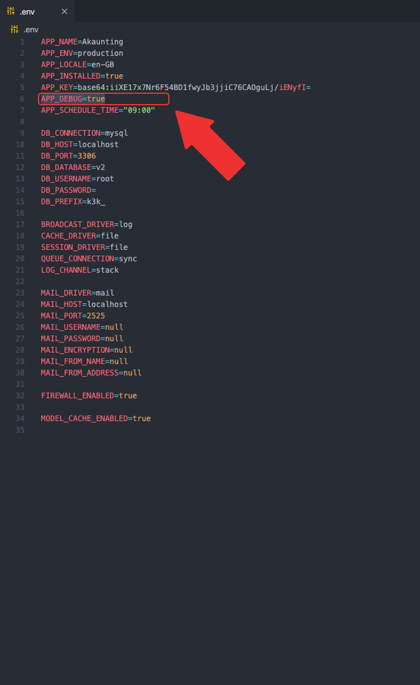
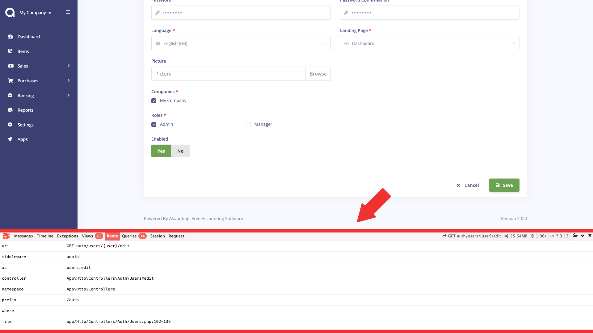

Debug
=====

As all the software outside, Akaunting is not perfect so you may encounter errors. In such a case, you may want to see the details of the error. To get that, you should enable the debug variable.

### Enable

By default, the debug is disabled as it designed to be used only in development environment. It can slow the application down (because it has to gather data). To enable it, set `true` the `APP_DEBUG` variable in the `.env` file, located in the root directory of your Akaunting installation.



### Debug Bar

Akaunting ships with the popular [Laravel Debugbar](https://github.com/barryvdh/laravel-debugbar) so that developers could easily monitor the software.

After enabling, all you have to do is to refresh any page in your Akaunting and you'll be able to see the debug bar. It will show messages, timeline, exceptions, database queries, request, route and a lot more.

You can also send messages to the debug bar:

```
Debugbar::info($object);
Debugbar::error('Error!');
Debugbar::warning('Watch out…');
Debugbar::addMessage('Another message', 'mylabel');
```

