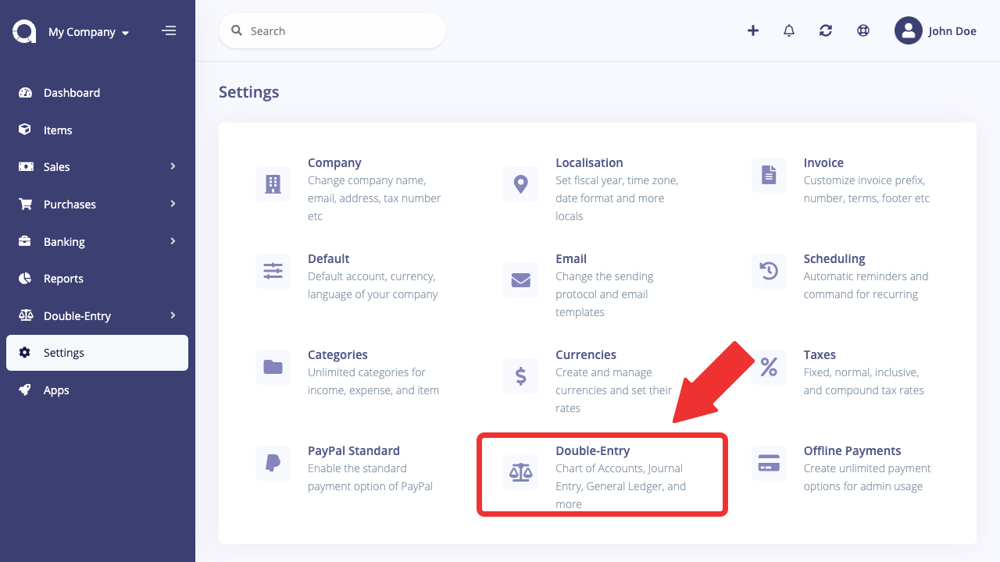

Menu
=====

The left sidebar of Akaunting contains the company switcher, search box, and menu. Akaunting uses the [nWidart](https://github.com/nwidart/laravel-menus) menu package as builder.

Some modules may want to extend the menu by adding their own pages, especially settings page.

### Simple Settings Page

We've tried the best to easy the life of developers. Mostly, developers just want to add just some inputs in the settings page. In such a case, you can add them to the `module.json` file and Akaunting will display them under the Settings menu.

All you have to do is to fill the `settings` array there.

```
"settings": [
    {
        "type": "textGroup",
        "name": "url",
        "title": "arastta::general.url",
        "icon": "globe",
        "attributes": {
            "required": "required"
        }
    },
    {
        "type": "textGroup",
        "name": "username",
        "title": "arastta::general.username",
        "icon": "user",
        "attributes": {
            "required": "required"
        }
    },
    {
        "type": "passwordGroup",
        "name": "password",
        "title": "arastta::general.password",
        "icon": "key",
        "attributes": {
            "required": "required"
        }
    }
]
```

And the result will be:



### Custom Page

If you're going to add a custom page or your settings page needs a little bit more actions then you can listen the `AdminMenuCreated` event for admin and/or `CustomerMenuCreated` for client side.

Lets firstly create the handler:

```
<?php

namespace Modules\Blog\Events\Handlers;

use App\Events\AdminMenuCreated;

class BlogAdminMenu
{
    /**
     * Handle the event.
     *
     * @param  AdminMenuCreated $event
     * @return void
     */
    public function handle(AdminMenuCreated $event)
    {
        // Add child to existing item
        $item = $event->menu->whereTitle(trans_choice('general.incomes', 2));
        $item->url('modules/blog/posts', 'Posts', 4, ['icon' => 'fa fa-angle-double-right']);

        // Add new item
        $event->menu->add([
            'url' => 'modules/blog/posts',
            'title' => 'Posts',
            'icon' => 'fa fa-rocket',
            'order' => 5,
        ]);
    }
}
```

Then add your handler/listener into the `boot` method of your service provider:

```
$this->app['events']->listen(AdminMenuCreated::class, BlogAdminMenu::class);
```

You can check the **Offline Payments** module built-in Akaunting as a live example.

[nWidart](https://nwidart.com/laravel-menus/v0.5/advanced-tools/finding-a-menu-item) documentation may also help to understand the system, especially about how to find a menu item and add child ones.