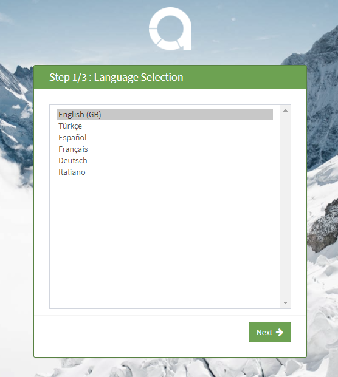
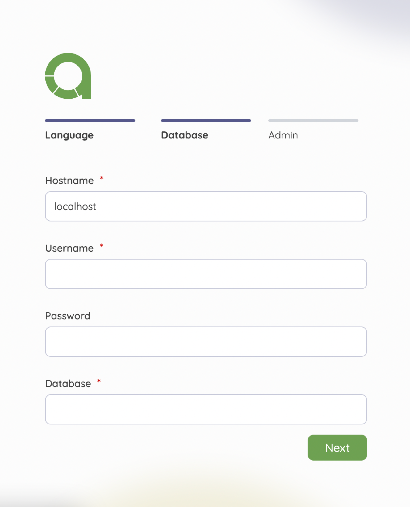
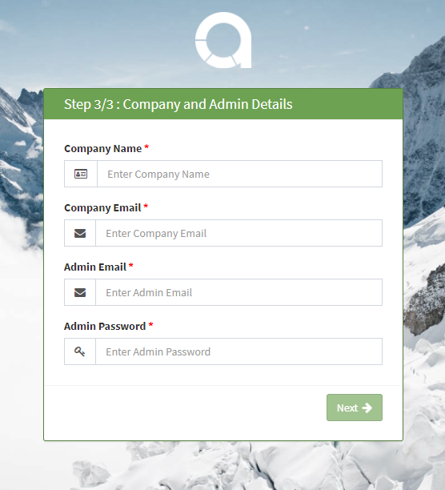
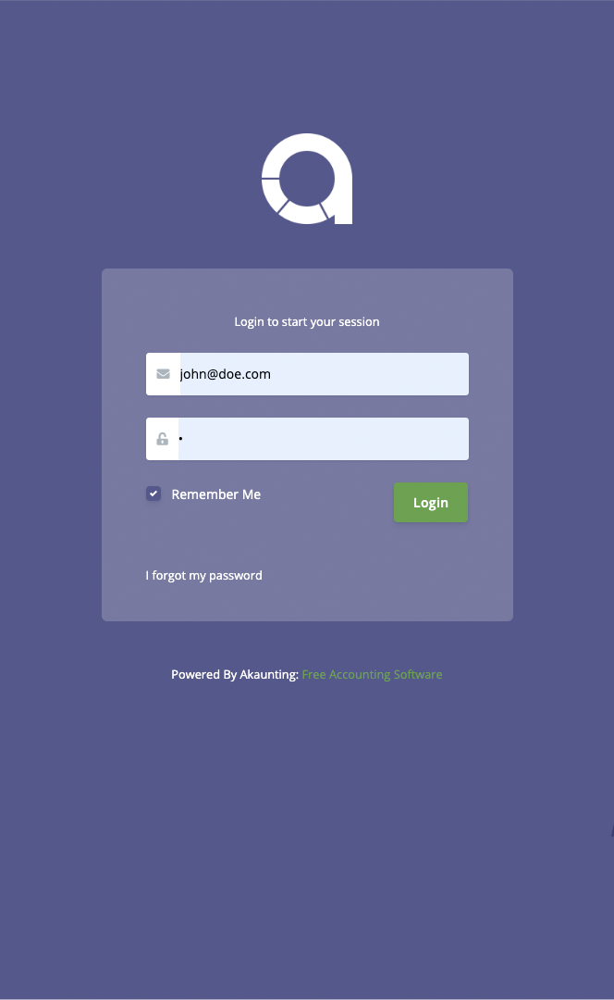

Installation
============

This guide will show you how to install Akaunting in your local or remote server just in a couple of minutes.

Steps
-----

1. [Download](https://akaunting.com/download) the Akaunting package.
2. Unzip the downloaded package.
3. Upload all the files to your server.

**Launch the Installer**

Open the link: `http://your-domain/akaunting-directory` in your browser. It will start the installation wizard.

### Step 1. Language

The first step is choosing which language you want to use. This is a good way for all who want to use a different language as default.

### Step 2. Database

You need to fill in the fields by adding the database connection details (Hostname, Username, Password and Database Name). 

### Step 3. Admin

This step allows you to add the Company Name & E-mail and also to create a new Admin account for administration access to your Akaunting. 

Login
-----

Now that installation is complete, you can log into the admin panel.

Support
-------

If there are any issues regarding installation, please visit the [Installation & Update](https://akaunting.com/forum) category of the Akaunting community forum.
