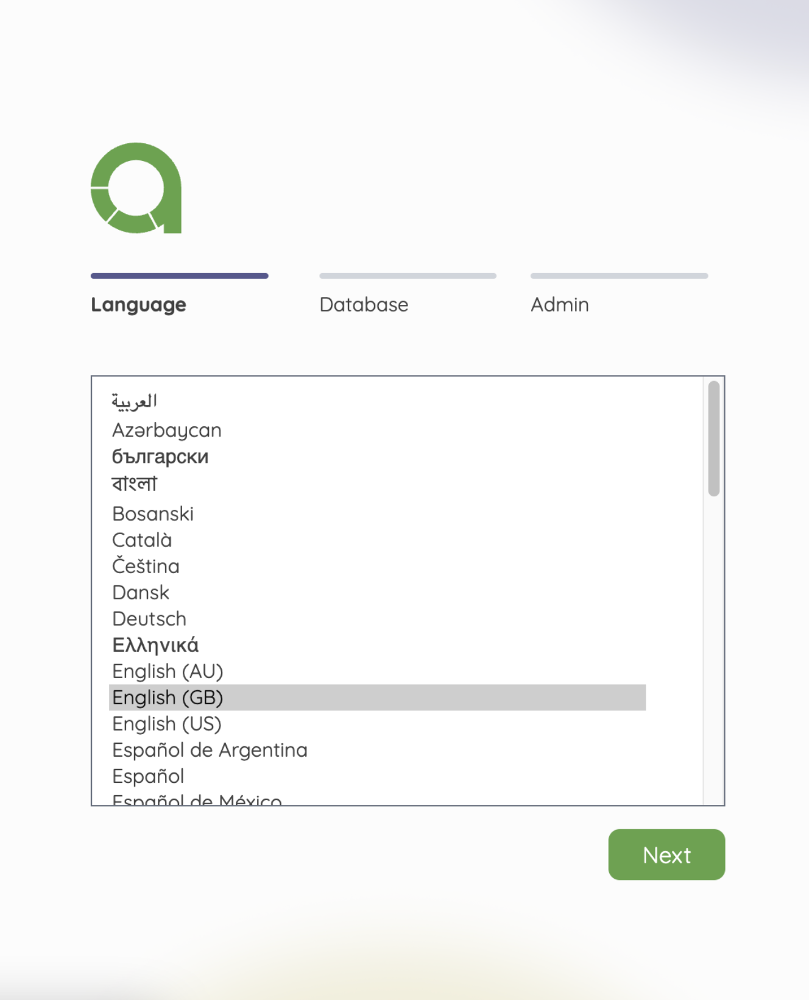
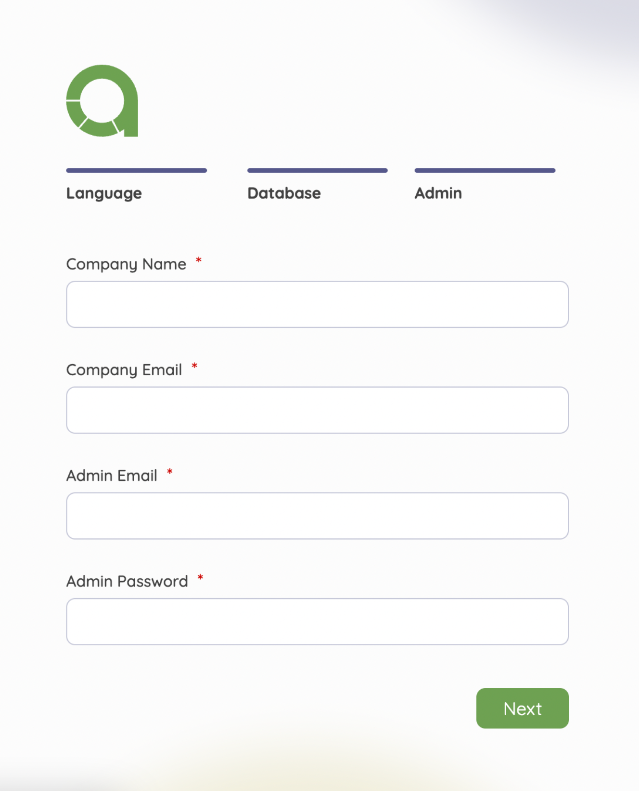
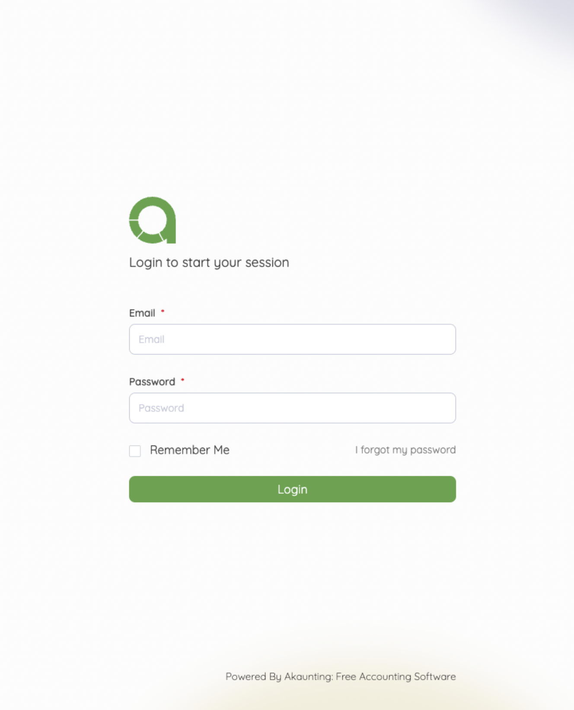

Installation
=======

Quick set-up instructions for beginners.
------------------------------------------

This guide will walk you through how to successfully install and uninstall Akaunting. Here you can find the [Detailed Installation](https://akaunting.com/docs) article for detailed set-up instructions.

Learn how to install Akaunting Free Accounting Software on your local or remote server in just minutes.

Installation Process
--------------------

 1. [Download](https://akaunting.com/download) the most recent Akaunting package.
 2. Upload the downloaded package onto your server.
 3. Unpack the Akaunting archive to the web-root directory of your server.

**Launch the Installer**

Open the link: `http://your-domain/akaunting-directory` in your browser. It will start the installation wizard.

Step 1. Language
------------------

The first step is choosing which language you want to use. This is a good way for all who want to use a different language as default.

Step 2. Database
-----------------

You need to fill in the spaces by adding the database connection details (Hostname, Username, Password and Database Name). 

Step 3. Company
------------------

This step allows you to add the Company Name & E-mail also to create a new Admin E-mail and Password for administration access to the Akaunting. 

Step 4. Finished
----------------

Now that installation is complete. You now have the option to browse the store front or choose to log into the admin panel.

Updating Akaunting
---------------------

Akaunting releases new versions from time to time with updated features and bug fixes. To learn how to update a store from an earlier version of Akaunting, visit [Updating Akaunting](https://akaunting.com/docs/update).

Uninstalling Akaunting
------------------------
Uninstalling Akaunting is a quick and simple process.

 1. Delete the files/folders in the location you uploaded them to in Filezilla.
 2. Delete the Akaunting database from MySQL Databases or phpMyAdmin.
 
Once Akaunting is uninstalled, all product and customer information will be lost. You can save a backup database file in case you want to reinstall Akaunting at a later time.

Supporting
-----------

If there are any issues regarding your program's installation or update, please visit the [Installation, Upgrade, and Settings Support](https://akaunting.com/forum) section of the Akaunting community forum.
