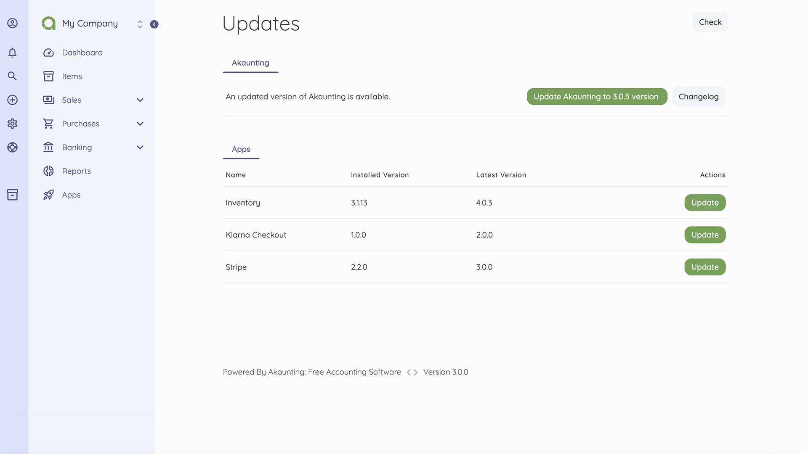

Update
======

Akaunting is periodically updated with new versions. Each new version released brings the advantage of bug fixes and new features.

Thanks to the One-Click Update feature of Akaunting, it takes just a couple of minutes to get the latest version. All you have to do is to click the Update notification button at the right top. After that you will be redirected to the "Updates" page.



There are two sections, **Akaunting** and **Apps**.

If you are using the latest version of Akaunting then you will see a message on top saying "Congratulations! You have the latest version of Akaunting".

The **Changelog** button will display the changelog of all missing versions on a pop-up window so you will be informed about all new features, changes, fixes and removes for each version.

### Manual Update

If you have SSH access to your server you can update Akaunting manually by running the following command from console:

```
php /your/akaunting/directory/artisan update:all
```

If you want to update a specific app:

```
php /your/akaunting/directory/artisan update blog 1
```

* blog: Alias of the app/module, use "core" for Akaunting itself
* 1: Company id

If you don't have SSH access, you may ask your hosting company to run that command.
