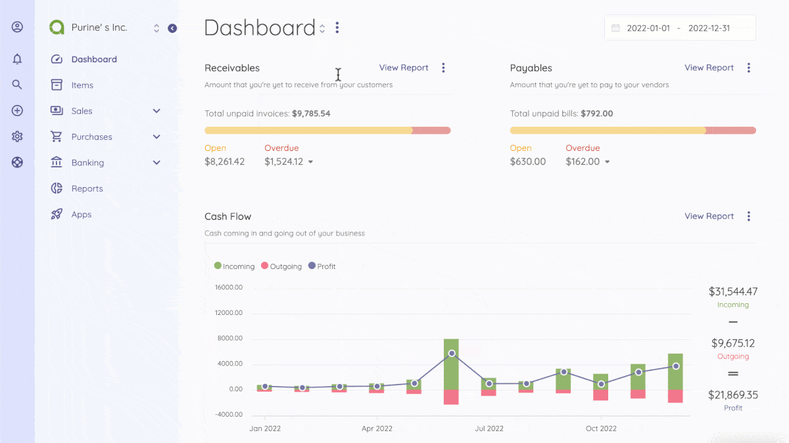

Overview
=========

Akaunting is a free, open-source, and online accounting software for small businesses and freelancers. It is built with modern technologies such as Laravel, VueJS, RESTful API, etc. Akaunting ships with core accounting tools needed to manage your business finances conveniently. Instead of creating bloated software by adding all of them to the core, we've made a modular structure so that it can get extended easily.

For example, an app can connect your online store built with WooCommerce so that products, customers, and orders can automatically be transferred to the Akaunting. Another one may connect with a CRM. And another one may be a payment gateway such as PayPal, Stripe, etc., to be used on the client-side of the Akaunting software to pay invoices online.

To access the App Store from your Akaunting software installation and install the apps you've purchased, you need to get your API Key and enter it when asked.

