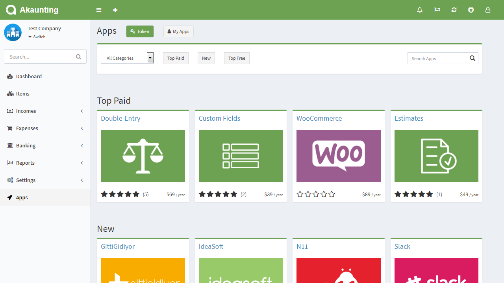
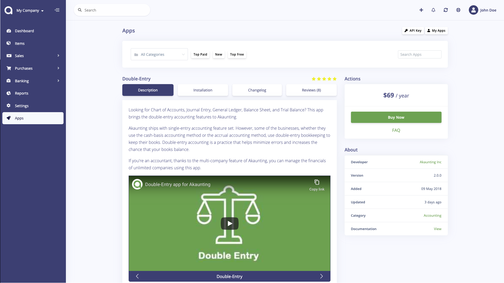
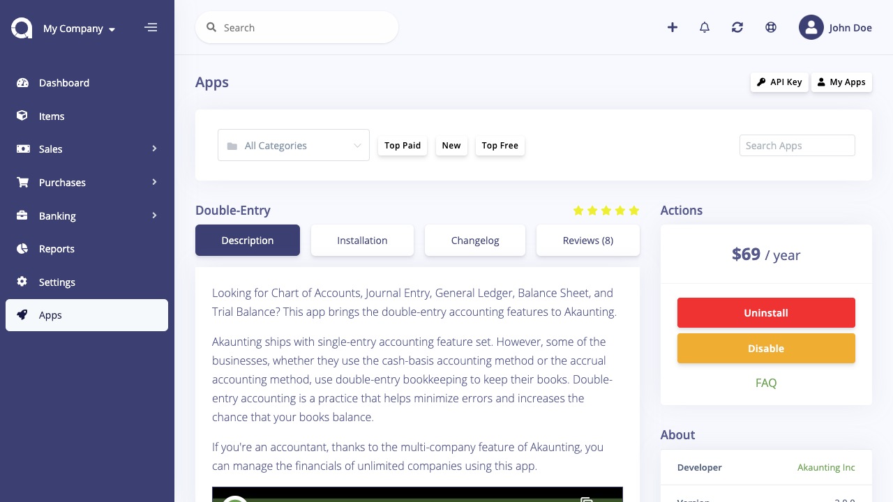

App Store
=========

While we strongly believe that Akaunting is the best free accounting software out there, we're very well aware that it's not perfect, just like everything in the real world. Akaunting ships with core accounting tools needed to manage the money. For further features, instead of creating a bloated software by adding all of them to the core, we've created a modular structure so that it could get extended easily.

For example, an app can connect your online store built with WooCommerce so that products, customers, and orders could get transferred to Akaunting automatically. Another one may connect with a CRM. And another one may be a payment gateway such as PayPal, Stripe etc to be used on the client side of Akaunting software to pay invoices online.

## API Key

In order to access the App Store from your Akaunting software installation, and install the apps you've purchased, you will need to get your [API Key](https://akaunting.com/dashboard) and enter it when you get asked for. That is the bridge between the software and site (akaunting.com).

## Buy

Apps can be free or paid. Paid apps are sold under a yearly subscription plan.

After you click on the *Buy Now* button, you'll be redirected to *akaunting.com* site to make the payment. After the payment proccess is finished, you'll be redirected back to your Akaunting software and you'll be able to install the app within one click, no need for download-upload etc.

You can always cancel your subscription from the [subscriptions](https://akaunting.com/subscriptions) page. In such a case, you can still continue to use the app but can't get further support and updates.

## Uninstall/Disable

You can uninstall and/or disable the app from their details page. Paid apps are connected to your account at *akaunting.com* site so you can always install them back again.

## App Settings

App settings are available in the [Settings](https://akaunting.com/docs/user-manual/settings/settings) page.
