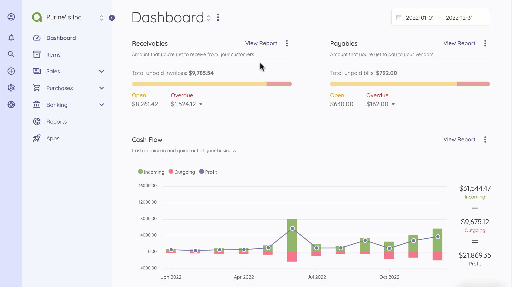
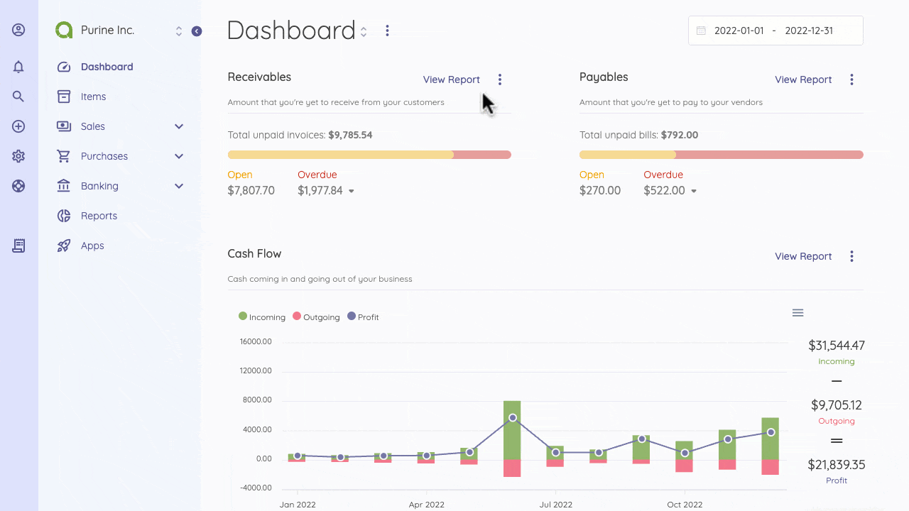

Accounts
=========

You can see a list of your accounts under Banking>Accounts. On the Accounts page, you can create, edit or delete accounts. 
Each transaction changes the amount of cash in your account(s). 

At the top right corner of the Accounts page, you'll find the New Account and Connect Your Bank buttons. The New Account button allows you to add new accounts for everyday transactions on Akaunting. At the same time, [Connect Your Bank](https://akaunting.com/apps/bank-feeds) lets you automatically import your bank transactions into Akaunting through the Bank Feeds feature on the [Premium Plan](http://akaunting.com/plans).

To create a new account, click on the New Account button at the top of the Accounts page and enter the required details on the New Account page. You can add a Bank Account or a Credit Card account.

The following fields are displayed when creating a new account:

- **Type**: Choose between Bank or Credit Card account name: Account's name
- **Number**: Account's number
- **Currency**: The default currency of the account
- **Opening Balance**: The amount you'll be depositing in the account.
- **Default account**: Make the account your default for your bookkeeping transactions
Bank - You may have multiple bank accounts in more than one Bank. Recording information about your Bank will make it easier to match the transactions within your Bank.
- **Bank Name**: Enter the Bank's name
- **Bank Phone**: Enter the Bank's Phone number
- **Bank address**: Enter the Bank's address

You can see all the transactions associated with an account by clicking on an account from the Accounts page.
