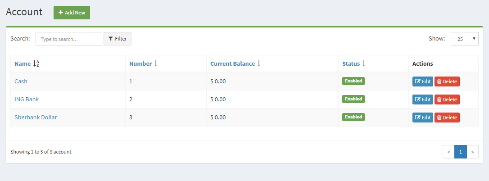
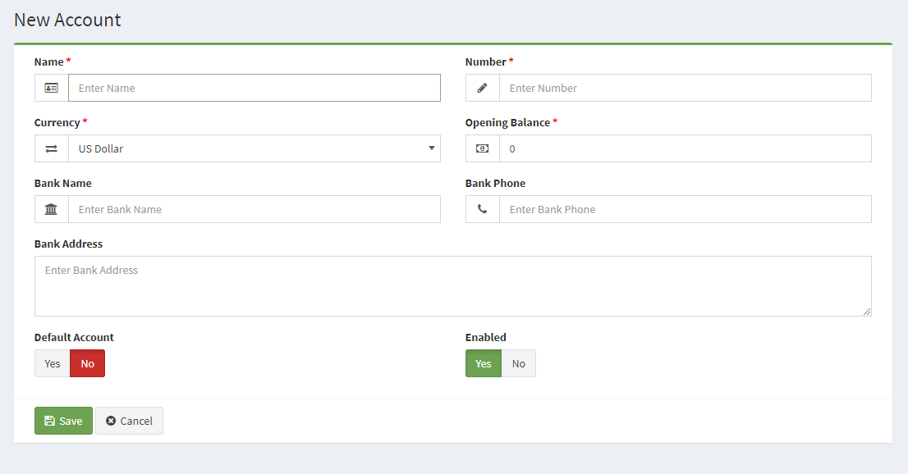

Accounts
========

The Accounts section is located under **Banking > Accounts**. On this page, every account ever made is listed in detail.

The following details are displayed for each return on the list:

- **Name**: the account name
- **Number**: the account number
- **Current Balance**: the account's current balance
- **Status**: the account to pay.

Add new account
------------------------------

The following details are displayed as blank to be filled, some are required and some not. Those who are marked with red star are required fields.

- **Name**: the account name
- **Number**: the account number
- **Currency**: The currency to be used in the account.
- **Opening Balance**: the account opening balance.
- **Bank Name**: the bank name
- **Bank Phone**: the bank phone number
- **Bank Address**: the bank address
- **Default Account**: Selecting "Yes" makes this account is selected for all account field.
- **Enabled**: Selecting "Yes" makes the account publicly available in the software. Selecting "No" will hide the account from accounts field, but will still be available for editing purposes in the administration.

