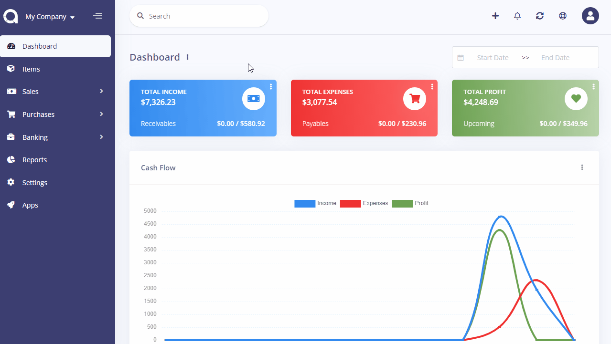
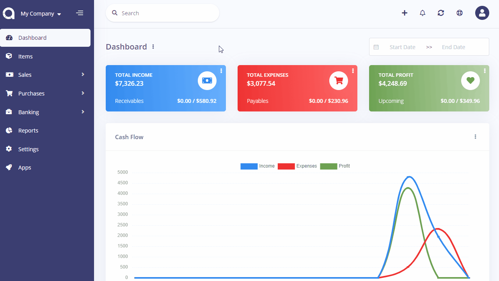

Reconciliations
===============

Bank reconciliation is a process performed to ensure that your company's income and expense records are correct and that the bank's records are also correct.

Reconciled income/expense transactions get protected so they can't be deleted.

Reconciliations page is located under **Banking > Reconciliations** menu. On this page you can see all reconciliations, search for any, create a new one, edit the current ones and delete them.

The following fields are displayed:

- **Created Date**: The date reconciliation is performed.
- **Account**: The bank account name that the reconciliation is performed for.
- **Period**: The start and end date of the reconciliation.
- **Closing Balance**: The reconciled balance.
- **Status**: Status of the reconciliation.
- **Actions**: You can use this button to edit, and delete the reconciliation.

## New Reconciliation

The following fields are displayed as blank to be filled, some are required and some not. Those marked with red star are required.

- **Start Date**: Select the start date of the period you would like to reconcile.
- **End Date**: Select the end date of the period you would like to reconcile.
- **Closing Balance**: Enter the closing balance that is in accordance with your physical bank account.
- **Account**: The bank account name that the reconciliation will be performed for.
- **Transactions**: The list of the transactions (income/expense) that will be reconciled.
    - **Date**: The date of the transaction.
    - **Description**: The description of the transaction.
    - **Contact**: The customer or vendor.
    - **Deposit**: The amount if the transaction is an income record.
    - **Withdrawal**: The amount if the transaction is an expense record.
    - **Clear**: Option to reconcile the transaction or not.
    - **Closing Balance**: The of balance of your physical bank account.
    - **Cleared Amount**: The of amount of the cleared transactions.
    - **Difference**: You need to make sure that the *Closing Balance* and *Cleared Amount* are in sync and the Difference shows 0.

You may save the reconciliation and continue later or finish it by clicking reconcile button.

