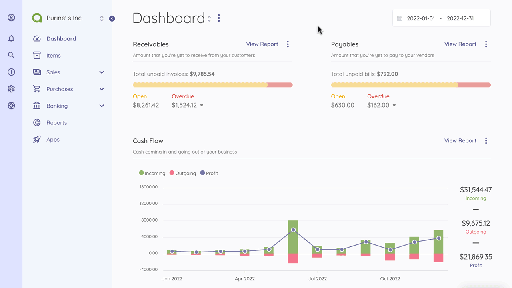

Transactions
============

Transactions page is located under **Banking > Transactions** menu. This page shows up all the actions made for each account. You can easily see the transaction date, type, category, amount etc and sort the records as you wish.

The following fields are displayed:

- **Date**: Transaction's date.
- **Account Name**: The account	affected by the transaction
- **Type**: Type of the transaction.
- **Category**: Category of the transaction.
- **Description**: Any applicable description.
- **Amount**: The amount of the transaction.

