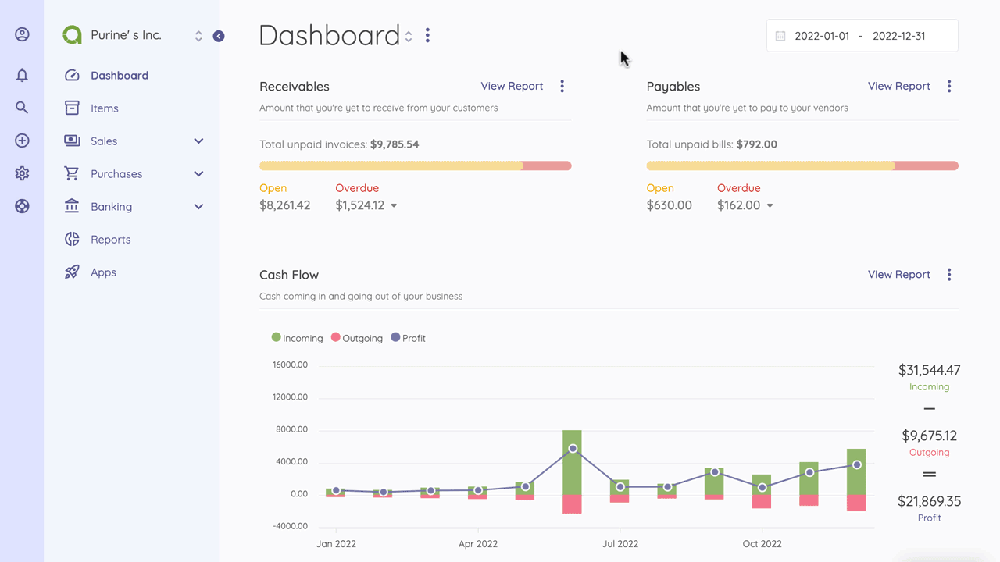

Transactions
=========

Transactions keep records of the income and expenses of your business. This page shows up all the transactions made for each account. 
You can easily see the transaction date, type, account, contact, and amount.
All transactions are added under income and expense types. 

You can connect transactions with invoices or bills. So documents you have recorded match your income and expense records.

At the top right of the Transactions page, you can add New Income or New Expense by clicking on the buttons. To import a list of transactions, you should download the sample template.

