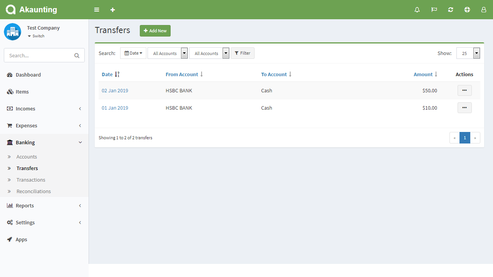
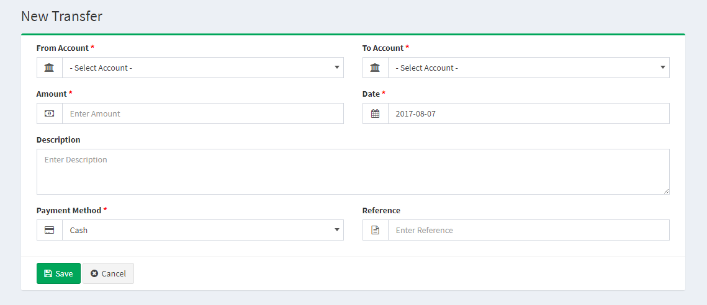

Transfers
========

The Transfers section is located under **Banking > Transfers**. On this page, every transfer ever made is listed in detail.

The following details are displayed for each return on the list:

- **Date**: the transfer date
- **From Account**: the transfer from account	
- **To Account**: the transfer to account
- **Amount**: the amount of the transfer.

Add new transfer
------------------------------

The following details are displayed as blank to be filled, some are required and some not. Those who are marked with red star are required fields.

- **From Account**: the transfer from account	
- **To Account**: the transfer to account
- **Amount**: the amount of the transfer.
- **Date**: the transfer date.
- **Description**: here you can add custom description especial for the transfers.
- **Payment Method**: the transfer payment method.
- **Reference**: the transfer reference code.

