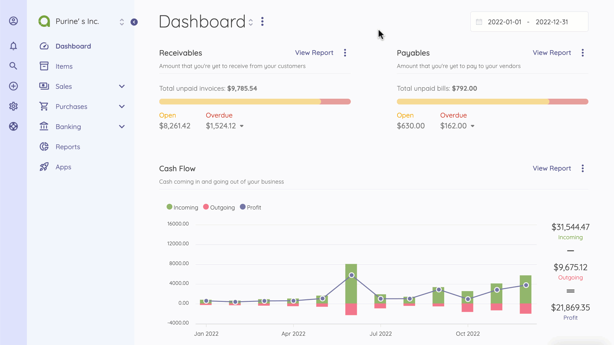
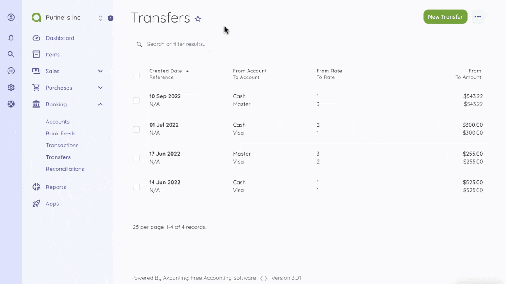

Transfers
=========

Sometimes you may want to transfer money from one account to another. For example, moving your cash money to bank. In such a case, Akaunting will create a revenue and payment record for the respected accounts.

Transfers page is located under **Banking > Transfers** menu. On this page you can see all transfers, search for any, create a new one, edit the current ones and delete them.

Money transferred between accounts with different currencies will be converted automatically by Akaunting, based on the currency rates you have set up from **Settings > Currencies** page.

The following fields are displayed:

- **Date**: Transfer date.
- **From Account**: The account	money get out.
- **To Account**: The account money get in.
- **Amount**: The amount of the transfer.

## New Transfer

The following fields are displayed as blank to be filled, some are required and some not. Those marked with red star are required.

- **From Account**: The account	money get out.
- **To Account**: The account money get in.
- **Amount**: The amount of the transfer.
- **Date**: Transfer date.
- **Description**: Custom description for the transfer.
- **Payment Method**: The method this transfer occured
- **Reference**: Any possible reference.

