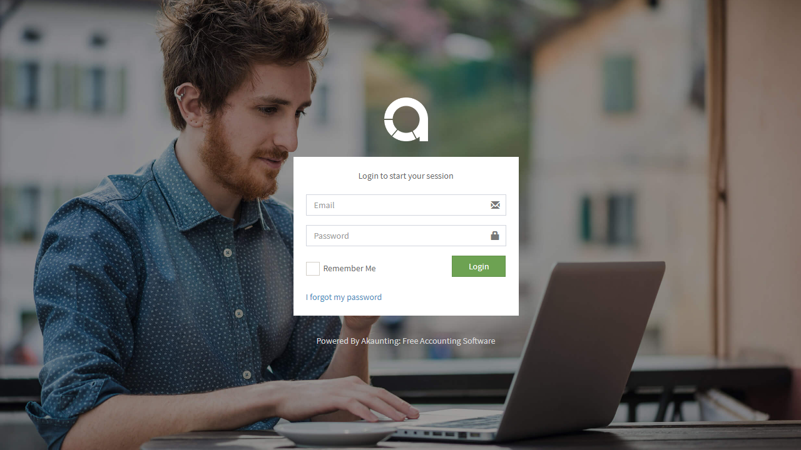
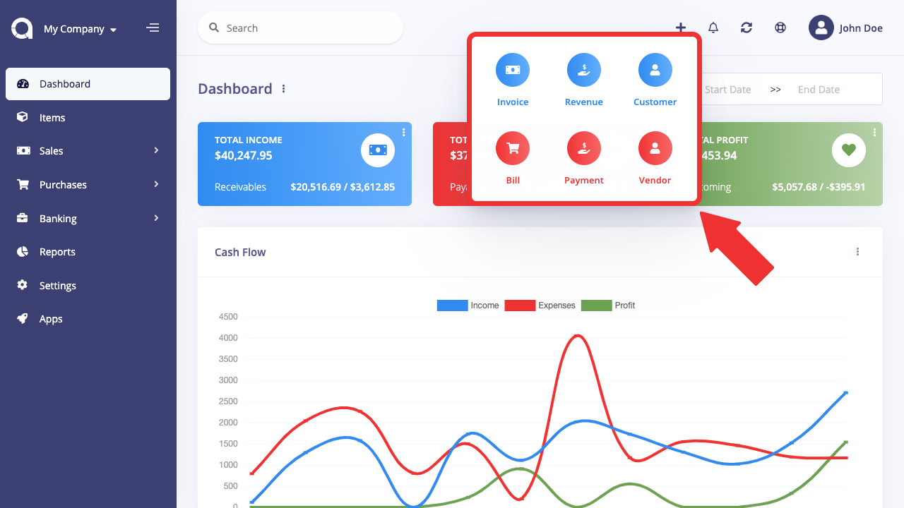

Dashboard
===========

Akaunting administration
----------------------

Akaunting's administration side of the store is where you can modify features, upload images, add products, keep track of customers, manage payments, and much more. Customization in the admin affects how the customer will interact with a store: by modifying the look, structure, and content of the store front.

Accessing the dashboard
-------------------------

To access the dashboard, type in location of the sofware into the web browser. For example, your software may be located at "www.chocolatechip.com". Even if the store is located in a sub-folder or on a sub-domain of their site, just typing the right software path will lead you to the administration side.

After filling in the correct email and password, pressing the "Login" button will direct you to the Arastta dashboard. When you first login to your software, the dashboard will be blank (as seen below), because there isn't any statistical data to be analysed yet.

Dashboard
---------

The dashboard is the first thing you will see when entering Akaunting's admin. The main function of the dashboard is to give the owner an overview of how the software is performing. There are 3 sections of the dashboard that can help you understand the statistical data collected by your store:

- **Top:** Akaunting calculates the numerical values for "*Total Incomes*", "*Total Expenses*" and "*Total Profit*" to alert you to approvals and keeping track.
- **Cash Flow:** A graph is provided to track the chronological progress of the software relative to the amount of *Income*, *Expense* and *Profit* over time. The x value is time; which can be days, or months depending on the range selected. The y value displays the number of total income(blue), total expense(red) and total profit(green).
- **Incomes By Category:** A pie chart is provide to track the progress of the incomes relative to the total amount of *Invoice*, *Deposit* and *Sales* over category.
- **Expenses By Category:** A pie chart is provide to track the progress of the expenses relative to the total amount of *Bill* and *Uncategorised* over category.
- **Account Balance:** It shows the total amount of each account you've added.
- **Latest Incomes:** A list that displays the last 5 incomes.
- **Latest Expenses:** A list that displays the last 5 expenses.

In the left side of the dashboard is the administration navigation menu. You can navigate between the "Income", "**Expense**", "**Banking**", "**Report**", "**Setting**" and "**App**". These sections will be explained in further detail in the following sections of the User Guide.

Quick Add
------

Quick Add is a handy tool that speed up the progress on adding new "**Incomes**", "**Expense**" and "**Banking**" operations throughout the Akaunting administration. It is simple and helpful for you if you want to perform the operation quickly.

