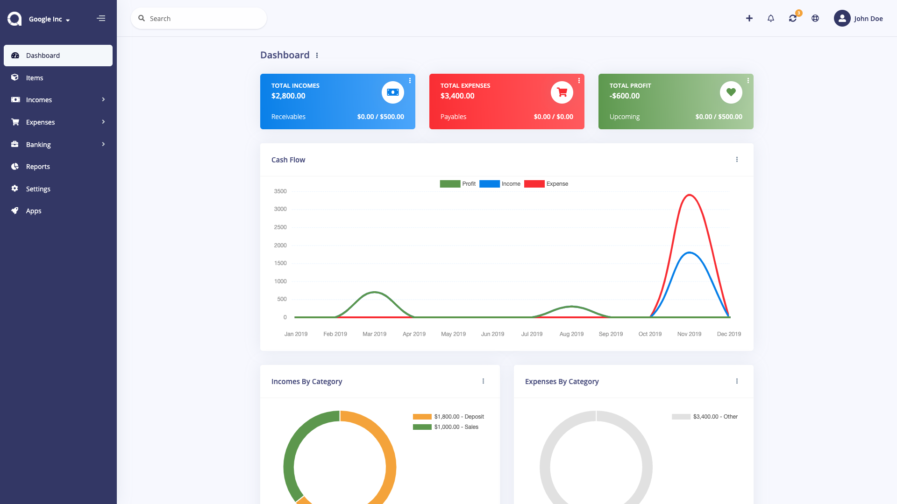
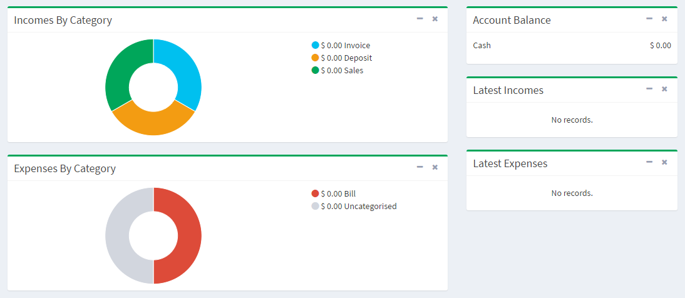

Dashboard
=========

The dashboard is the first thing you will see when entering Akaunting. The main function of the dashboard is to give the owner an overview of how the business is performing. Dashboard reports shows the accrued incomes and expenses. [Here](https://akaunting.com/docs/faq/accrual-vs-cash) you can learn more about accrual accounting.

- **Totals:** Sum up the income, expense and profit state of your business. They also show the upcoming data.
- **Cash Flow:** Shows the income, expense and profit per day and/or month.
- **Incomes By Category:** A pie chart to show the distribution of incomes. *Invoices* are a shown as a category of itself.
- **Expenses By Category:** A pie chart to show the distribution of expenses. *Bills* are a shown as a category of itself.
- **Account Balance:** It shows the balance of each account you've added.
- **Latest Incomes:** A list that displays the last 5 incomes.
- **Latest Expenses:** A list that displays the last 5 expenses.

### Menu

In the left side of there is a navigation menu. You can navigate between the **Items**, **Incomes**, **Expenses**, **Banking**, **Reports**, **Settings** and **Apps**. These sections will be explained in further detail in the following sections of the User Manual.
