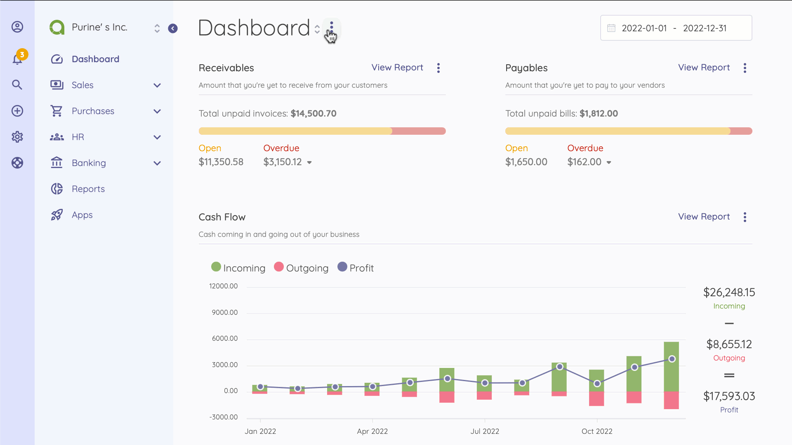
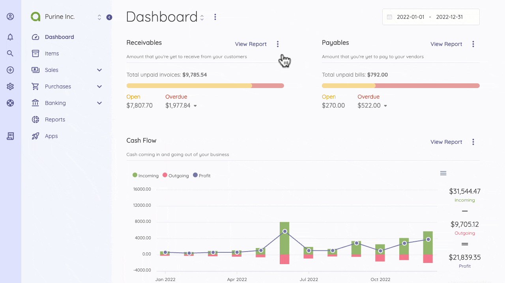

Dashboard
=========

Dashboard is the first thing you will see when entering Akaunting. It is an adjustable view that contains many types of information widgets, such as income/expense/profit totals, cash flow, incomes/expenses by category, latests incomes/expense, and more added by apps. You can have several dashboards that serve different purposes. You can also switch between them.

Widgets show the accrued incomes and expenses, except Cash Flow chart. [Here](https://akaunting.com/docs/faq/accrual-vs-cash) you can learn more about cash and accrual accounting.

## Multiple Dashboards

You can have several dashboards that serve different purposes, switch between, and share them with your staff/accountant. To create a dashboard, click on the horizontal ellipsis (three dots) nearby the **Dashboard** word. Then, select the **Create Dashboard** option.

After adding new dashboards, the *Dashboard* menu will turn into a dropdown menu from where you can switch between dashboards.

## Widgets

Akaunting ships with a number of widgets out-of-the-box that can simplify the day-to-day activities.

 |        Widget        | Description                                                                                                          |
 | :------------------: | :------------------------------------------------------------------------------------------------------------------- |
 |        Totals        | Sum up the income, expense and profit state of your business. They also show the upcoming (not paid) invoices/bills. |
 |      Cash Flow       | Shows the income, expense and profit in cash per month/quarter.                                                      |
 | Incomes By Category  | A pie chart to show the distribution of incomes.                                                                     |
 | Expenses By Category | A pie chart to show the distribution of expenses.                                                                    |
 |   Account Balance    | It shows the balance of each account you've added.                                                                   |
 |    Latest Incomes    | A list that displays the last 5 incomes.                                                                             |
 |   Latest Expenses    | A list that displays the last 5 expenses.                                                                            |

Total and chart widgets are displayed under the default currency. Invoices, revenues, bills, and payments created under a different currency will be converted based on the currency rate at the time they were created.

## Apps

Apps can also create a seperate dashboard with their specific widgets. For example, the [CRM](https://akaunting.com/apps/crm) app creates its own dashboard with widgets concentrated in customer relationship. The same process is available for [Payroll](https://akaunting.com/apps/payroll), [Double-Entry](https://akaunting.com/apps/double-entry), and lots of apps.
