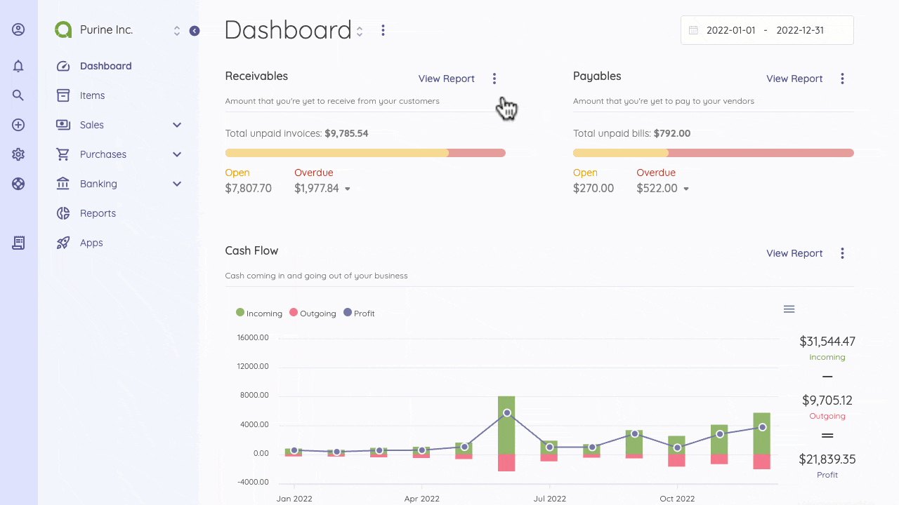

Add Widgets
=========

Sections in dashboards are called widgets. They are designed to give you a quick picture of the information that can be digestible at a glance. For further details, you can always use Reports.

To add a widget, click on the three dots at the top of the dashboard page and select the "Add Widget" option. A window opens with fields for name, type, Width, and Sort.

You can choose the widget size by selecting the Width, while Sort lets you decide where you want it positioned on the Dashboard.

Now you know how to personalize your dashboards, let's deep dive into the default widgets on your Dashboard.

