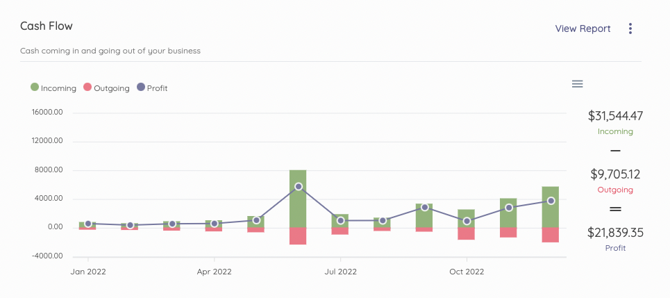

Cash Flow
=========

The Cash Flow section helps you analyze the cash coming in and out of your company within a set timeframe. This section displays the performance chart, income, expense, and profitability.

You can always get more information by clicking on View Report.

