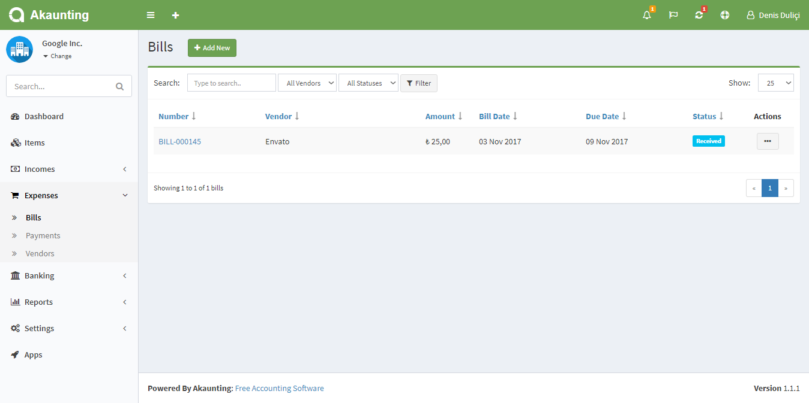
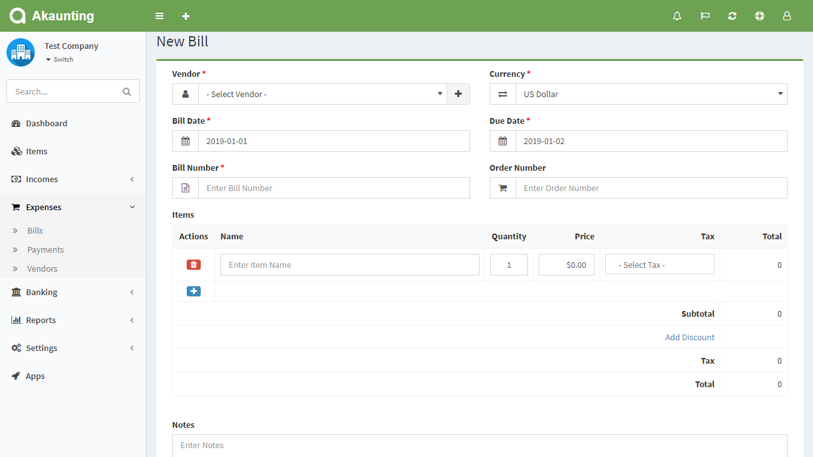
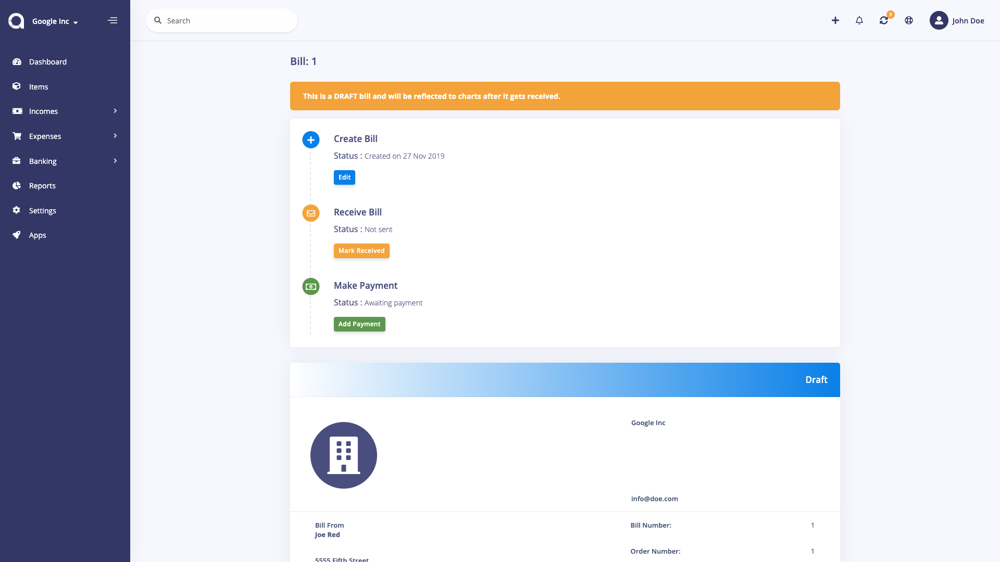

Bills
=====

Bills page is located under **Expenses > Bills**. On this page you can see all bills, search/filter for any, create a new one, edit the current ones and delete them.

The following fields are displayed:

- **Number**: The number assigned to the bill, by your vendor.
- **Vendor**: To whom will pay the bill.
- **Amount**: Amount of the bill.
- **Bill Date**: Date when the bill is issued.
- **Due Date**: Date when the bill is due to be paid.
- **Status**: The status of the bill.
- **Actions**: You can use this button to show, edit, duplicate, and delete the bill.

## New Bill

The following fields are displayed as blank to be filled, some are required and some not. Those marked with red star are required.

- **Vendor**: To whom will pay the bill.
- **Currency**: Currency used.
- **Bill Date**: Date when the bill is issued.
- **Due Date**: Date when the bill is due to be paid.
- **Bill Number**: The number assigned to the bill, by your vendor.
- **Order Number**: A number assigned to an order for that bill.
- **Items**: The list of all items that can be assigned to that bill. You can add multiple items.
	- **Actions**: There are 2 (two) actions; Add and Delete.
	- **Name**: The name of item. It will populate records from *Items* page after you start typing their name. It can also be a custom item.
	- **Quantity**: Default is 1. You can enter decimal quantity (1.7)
	- **Price**: The purchase price of item. It will bring it automatically but you have the opportunity to change it if you want.
	- **Tax**: The list of applicable Tax Rates. You can select multiple taxes. See the *Settings > Tax Rates* documentation for more details.
	- **Total**: It will calculate automatically the total price of item according the quantity and tax. It is not an editable field.
	- **Subtotal**: The total prices of items without taxes.
	- **Tax**: The total price of taxes.
	- **Total**: The final amount of bill, including everything.
- **Notes**: You can add a custom note to the bill.
- **Category**: Category of the bill to be used in reports.
- **Recurring**: Automatically create bills for ongoing jobs. Times=0 means infinite. Don't forget to set the *Cron Command* available at *Settings > General > [Scheduling](https://akaunting.com/docs/user-manual/settings/general)*.
- **Attachment**: You can attach file related to the bill.

## Show Bill

The following image shows the details page of a bill:

### Actions

From the left bottom buttons, you can edit, print, delete, add payment, mark as received and apply a lot more actions.
