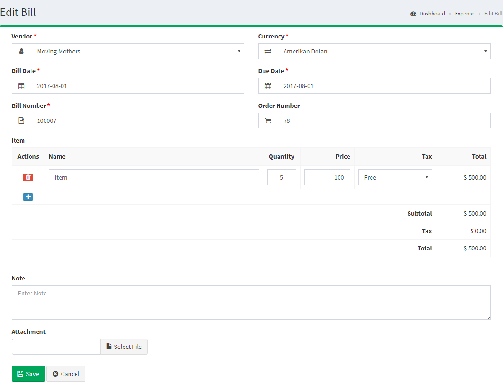
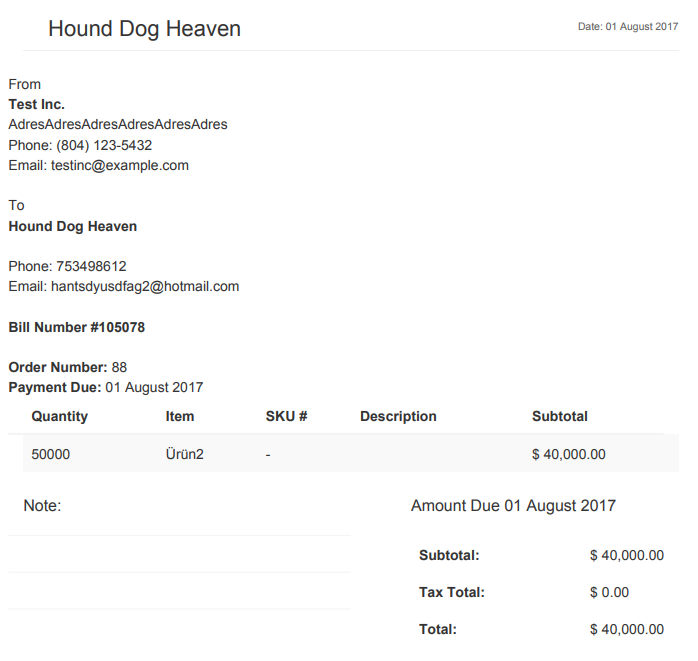

Bills
===

Bill management
------------------------------

The Bills section is located under **Expenses > Bills**. On this page, every bill ever made is listed in detail.

The following details are displayed for each return on the list:

- **Bill Number**: a number assigned to an bill.
- **Vendor**: shows the vendor name to whom is assigned the bill.
- **Bill Date**: the date when the bill started.
- **Due Date**: the date when the bill ended.
- **Bill Number**: a number assigned to an bill by Akaunting during the checkout confirmation.
- **Status**: shows the status of the bill. After the bill is initially created the status will be "New".
- **Total Price**: the total price of the bill.
- **Actions**: there are 3 (three) actions; Show, Edit and Delete.

Add new bill
------------------------------

This is the page where you can create new bills for all items added on "**Items**" page.

The following details are displayed as blank to be filled, some are required and some not. Those who are marked with red star are required fields.

- **Vendor**: shows the vendor name to whom will be assigned the bill. It will show the all list of vendors added from "*Expenses > Bills*".
- **Currency**: shows currency to be assigned to the bill. Shows the list of enabled currencies.
- **Bill Date**: the date when the bill will start.
- **Due Date**: the date when the bill will end.
- **Bill Number**: a number to be assigned to the bill.
- **Order Number**: a number assigned to an order for that bill.
- **Items**: the list of all items that can be assigned to that bill. You can add multiple items.
	- **Actions**: there are 2 (two) actions; Add and Delete.
	- **Name**: the name of the item. It is an autocomplete field, so just type the name of item and it will bring the list of all items according the typing.
	- **Quantity**: Default is 1.
	- **Price**: the price of item. It will bring it automatically but you have the opportunity to change it is you want.
	- **Tax**: shows the list which the items will be taxed. You can add new taxes or change the rate of tax from "*Setting > Tax Rate*".
	- **Total**: it will calculate automatically the total price of item according the quantity and tax. It is not an editable field.
	- **Subtotal**: shows the total of prices of items without taxes.
	- **Tax**: shows the total price of taxes.
	- **Total**: shows the total of prices of items including taxes.
- **Note**: here you can add custom notes especial for the bill.
- **Attachment**: here you can insert files for the bill.

Bill details
-------------

The following screenshot shows the details page of a bill:

PDF Bills
-------------

As an online software owner you should be aware of the importance and necessity of an efficient billing system and management in your accounting solution. So we have implemented PDF Bill feature and from now on you and your customers can manage and download the bills as PDF files.

