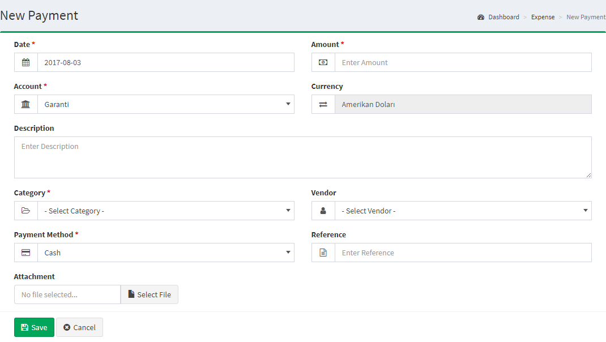

Payments
========

The Payments section is located under **Expenses > Payments**. On this page, every payment ever made is listed in detail.

The following details are displayed for each return on the list:

- **Date**: the payment date
- **Amount**: the amount of the payment
- **Category**: the date when the invoice started.
- **Account**: the account to pay.
- **Actions**: there are 2 (two) actions; Edit and Delete.

Add new payment
------------------------------

The following details are displayed as blank to be filled, some are required and some not. Those who are marked with red star are required fields.

- **Date**: the payment date
- **Amount**: the amount of the payment
- **Currency**: the currency to be paid.
- **Account**: the account to pay.
- **Category**: the category of the payment
- **Description**:  here you can add custom description especial for the payment.
- **Vendor**: an account to be paid.
- **Payment Method**: here you can choose the method for payment
- **Reference**:Reference code for payment.
- **Attachment**: here you can insert files for the payment.

