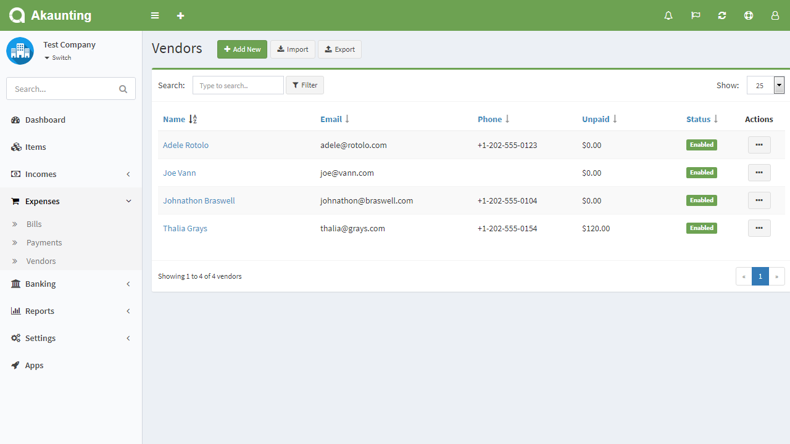
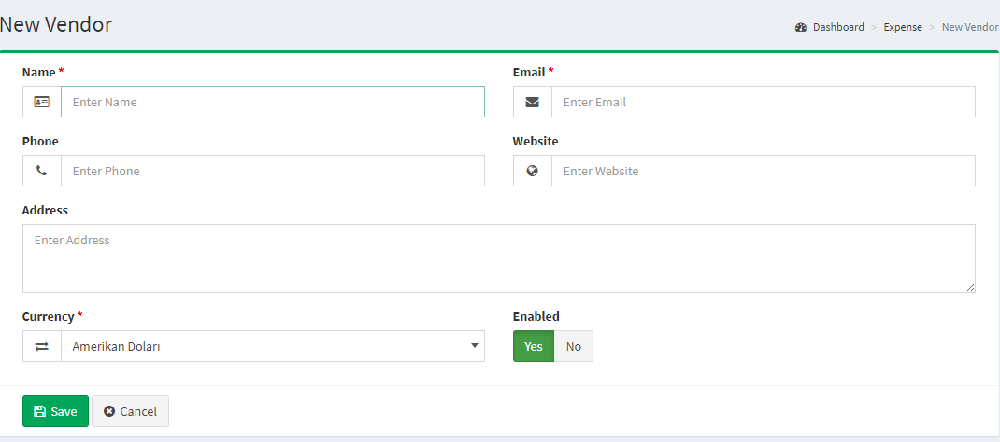

Vendors
========

The Vendor section is located under **Expenses > Vendors**. On this page, you can see every vendor ever create is listed in detail.

The following details are displayed for each return on the list:

- **Name**: the vendor's name.
- **Email**: the vendor's email adress.
- **Phone**: the vendor's phone number.
- **Status**: Enable or disable the vendor in the software

Add new vendor
------------------------------

The following details are displayed as blank to be filled, some are required and some not. Those who are marked with red star are required fields.

- **Name**: the vendor's name.
- **Email**: the vendor's email adress.
- **Phone**: the vendor's phone number.
- **Website**: the vendor's website.
- **Address**: the vendor's address
- **Currency**: the currency used by the vendor
- **Enabled**: Selecting "Yes" makes the vendor publicly available in the software. Selecting "No" will hide the vendor from expenses pages, but will still be available for editing purposes in the administration.

