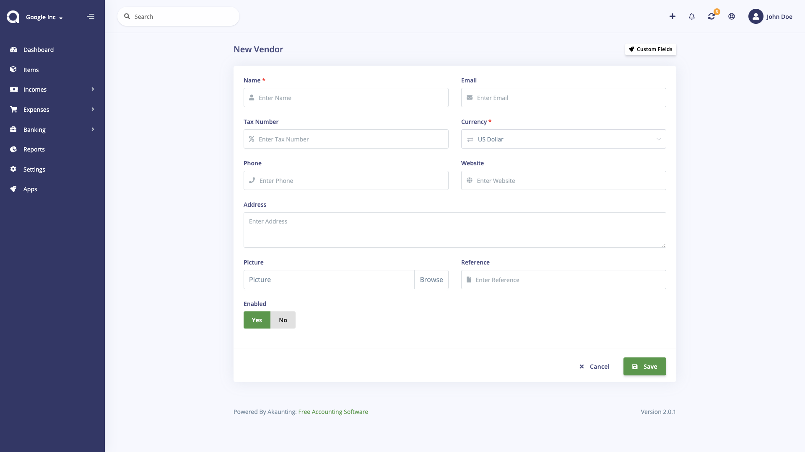

Vendors
=======

Vendors are required if you want to create bills. You can see the balance you owe and filter reports by the vendor. Vendors page is located under **Expenses > Vendors** menu.

The following details are displayed:

- **Name**: Vendor's name.
- **Email**: Vendor's email adress.
- **Phone**: Vendor's phone number.
- **Unpaid**: The amount that vendor is waiting to be paid for.
- **Status**: Status of the vendor.
- **Actions**: You can use this button to edit, duplicate, and delete the vendor.

## New Vendor

The following fields are displayed as blank to be filled, some are required and some not. Those marked with red star are required.

- **Name**: Vendor's full name.
- **Email**: Vendor's email adress.
- **Tax Number**: Vendor's tax number.
- **Currency**: Default currency to be used for the vendor.
- **Phone**: Vendor's phone number.
- **Website**: Vendor's website.
- **Address**: Vendor's address
- **Picture**: Vendor's picture to be used in bills as logo.
- **Reference**: Any possible reference.
- **Enabled**: Status of the vendor.

