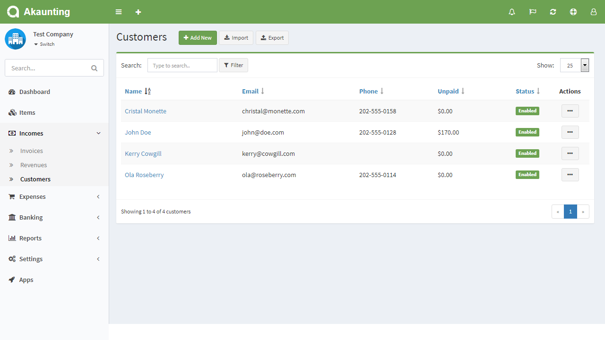
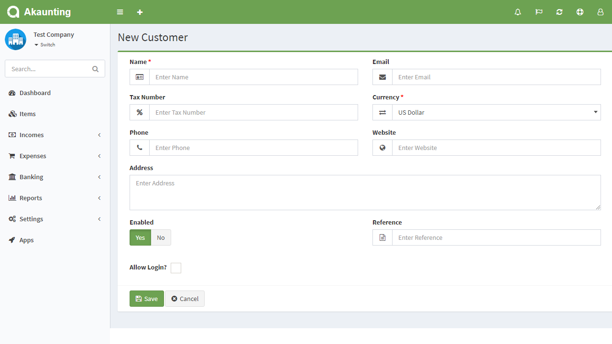

Customers
=========

Customers page is located under **Incomes > Customers** menu. On this page you can see all customers, search for any, create a new one, edit the current ones and delete them.

The following fields are displayed:

- **Name**: Customer's full name.
- **Email**: Customer's email address.
- **Phone**: Customer's phone number.
- **Status**: Status of the customer.
- **Actions**: You can use this button to edit, duplicate, and delete the customer.

## New Customer

The following details are displayed as blank to be filled, some are required and some not. Those who are marked with red star are required fields.

- **Name**: Customer's full name.
- **Email**: Customer's email address.
- **Phone**: Customer's phone number.
- **Website**: Customer's website.
- **Address**: Customer's address
- **Currency**: Default currency to be used for  the customer
- **Enabled**: Status of the customer.
- **Allow Login**: Selecting this option will ask you for password. You customer may access the Client Portal using their email and password and so on see/pay the invoices assigned to them.

