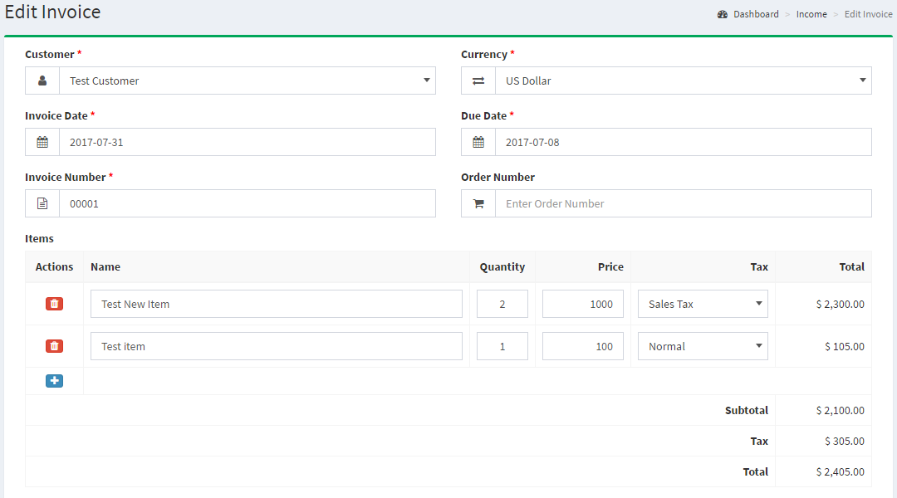
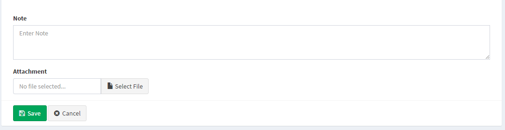
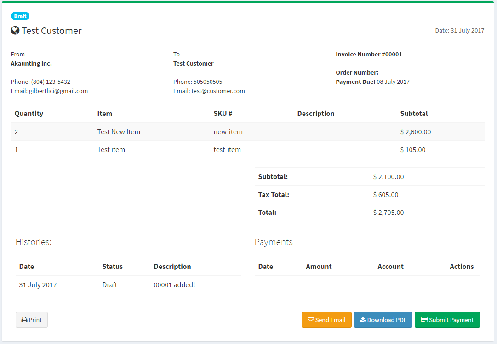
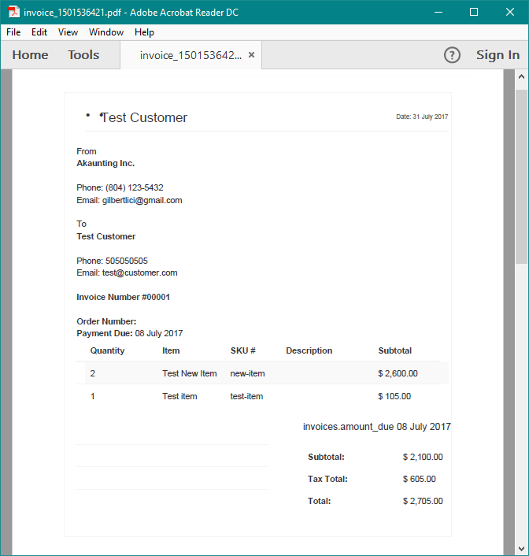

Invoices
======

Invoice management
------------------------------

The Invoices section is located under **Incomes > Invoices**. On this page, every invoice ever made is listed in detail.

The following details are displayed for each return on the list:

- **Invoice Number**: a number assigned to an invoice.
- **Customer**: shows the customer name to whom is assigned the invoice.
- **Invoice Date**: the date when the invoice started.
- **Due Date**: the date when the invoice ended.
- **Order Number**: a number assigned to an order by Akaunting during the checkout confirmation.
- **Status**: shows the status of the invoice. After the invoice is initially created the status will be "Draft".
- **Total Price**: the total price of the invoice.
- **Actions**: there are 3 (three) actions; Show, Edit and Delete.

Add new invoice
------------------------------

This is the page where you can create new invoices for all items added on "**Items**" page or custom ones.

The following details are displayed as blank to be filled, some are required and some not. Those who are marked with red star are required fields.

- **Customer**: shows the customer name to whom will be assigned the invoice. It will show the all list of customers added from "*Income > Customer*".
- **Currency**: shows currency to be assigned to the invoice. Shows the list of enabled currencies.
- **Invoice Date**: the date when the invoice will start.
- **Due Date**: the date when the invoice will end.
- **Invoice Number**: a number to be assigned to the invoice.
- **Order Number**: a number assigned to an order for that invoice.
- **Items**: the list of all items that can be assigned to that invoice. You can add multiple items.
	- **Actions**: there are 2 (two) actions; Add and Delete.
	- **Name**: the name of the item. It is an autocomplete field, so just type the name of item and it will bring the list of all items according the typing. It can be a custom item or any already added into Items page.
	- **Quantity**: Default is 1.
	- **Price**: the price of item. It will bring it automatically but you have the opportunity to change it is you want.
	- **Tax**: shows the list which the items will be taxed. You can add new taxes or change the rate of tax from "*Setting > Tax Rate*".
	- **Total**: it will calculate automatically the total price of item according the quantity and tax. It is not an editable field.
	- **Subtotal**: shows the total of prices of items without taxes.
	- **Tax**: shows the total price of taxes.
	- **Total**: shows the total of prices of items including taxes.
- **Note**: here you can add custom notes especial for the invoice.
- **Attachment**: here you can insert files for the invoice.

Invoice details
-------------

The following screenshot shows the details page of an invoice:

PDF Invoices
-------------

As an online software owner you should be aware of the importance and necessity of an efficient invoicing system and management in your accounting solution. So we have implemented PDF Invoice feature and from now on you and your customers can manage and download the invoices as PDF files.

