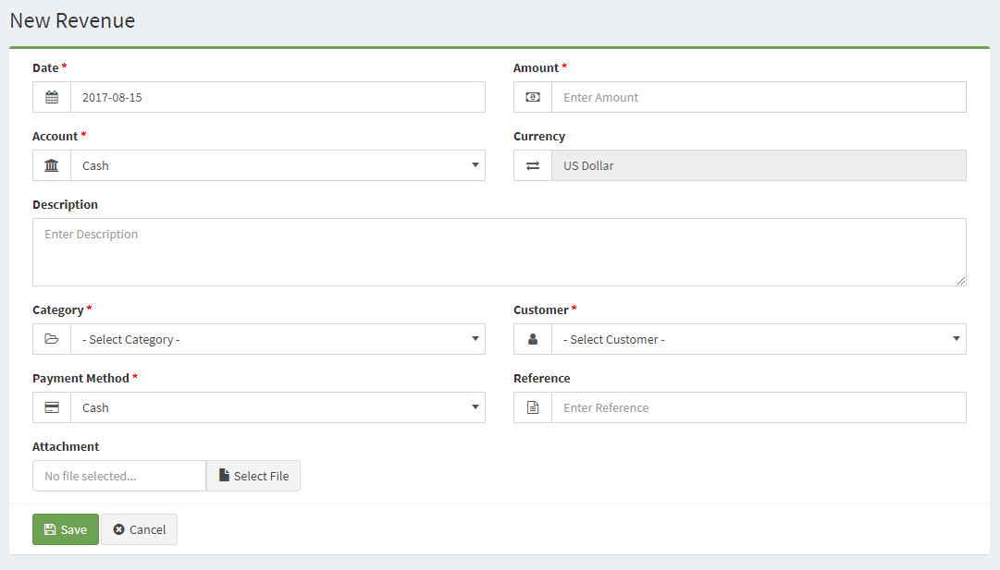

Revenues	
========

Revenue management
------------------------------

The Revenues section is located under **Incomes > Revenues**. On this page, every revenue ever made is listed in detail.

The following details are displayed for each return on the list:

- **Date**: the revenue date.
- **Amount**: the amount of the revenue.
- **Customer**: the customer to pay the revenue.
- **Category**: the category of the revenue.
- **Account**: Account to be paid.
- **Actions**: there are 2 (two) actions; Edit and Delete.

Add new revenue
------------------

The following details are displayed as blank to be filled, some are required and some not. Those who are marked with red star are required fields.

- **Date**: shows  the revenue date.
- **Amount**: the amount of the revenue.
- **Account**: Account to be paid
- **Currency**: the currency to be paid.
- **Description**: here you can add custom description especial for the revenue.
- **Category**: the category of the revenue
- **Customer**: the customer to pay the revenue.
- **Payment Method**: here you can choose the method for revenue.
- **Reference**:the reference code for your revenue.
- **Attachment**: here you can insert files for the revenue.

