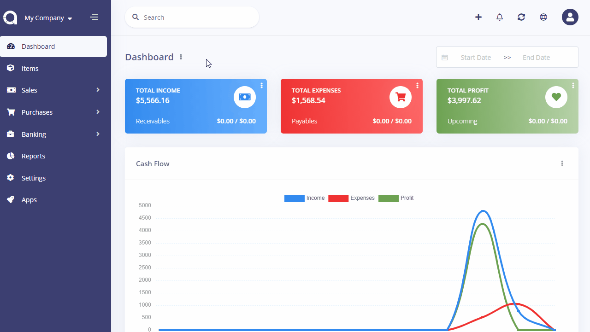
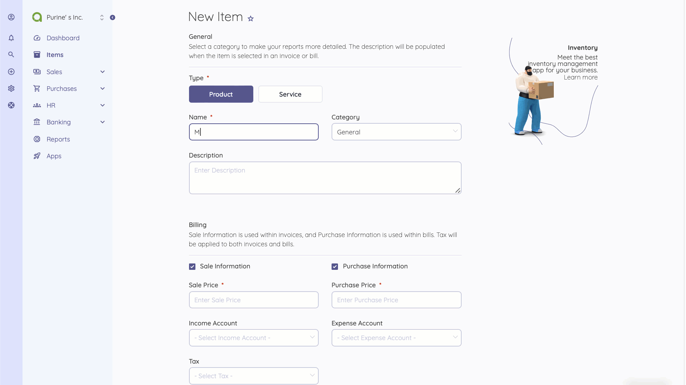

Items
=====

Items can be products or services. You can use items when creating invoices and bills to have the price, tax etc fields populated.

Check out the [Inventory](https://akaunting.com/apps/categories/inventory) app for stock control and further product management.

The following fields are displayed:

- **Picture**: Item's picture.
- **Name**: The name of product/service.
- **Category**: Category of item, if applicable.
- **Sale Price**: This price will be populated in invoices.
- **Purchase Price**: This price will be populated in bills.
- **Enabled**: Disabled items won't get populated when creating invoices/bills.
- **Actions**: You can use this button to edit, duplicate, and delete the item.

## New Item

The following details are displayed as blank to be filled, some are required and some not. Those marked with red star are required.

- **Name**: The name of product/service.
- **Tax**: Any applicable tax. It will be populated when creating invoices/bills.
- **Description**: Item's description, if applicable.
- **Sale Price**: This price will be populated in invoices.
- **Purchase Price**: This price will be populated in bills.
- **Category**: Category of item, if applicable.
- **Picture**: Item's picture.
- **Enabled**: Disabled items won't get populated when creating invoices/bills.

