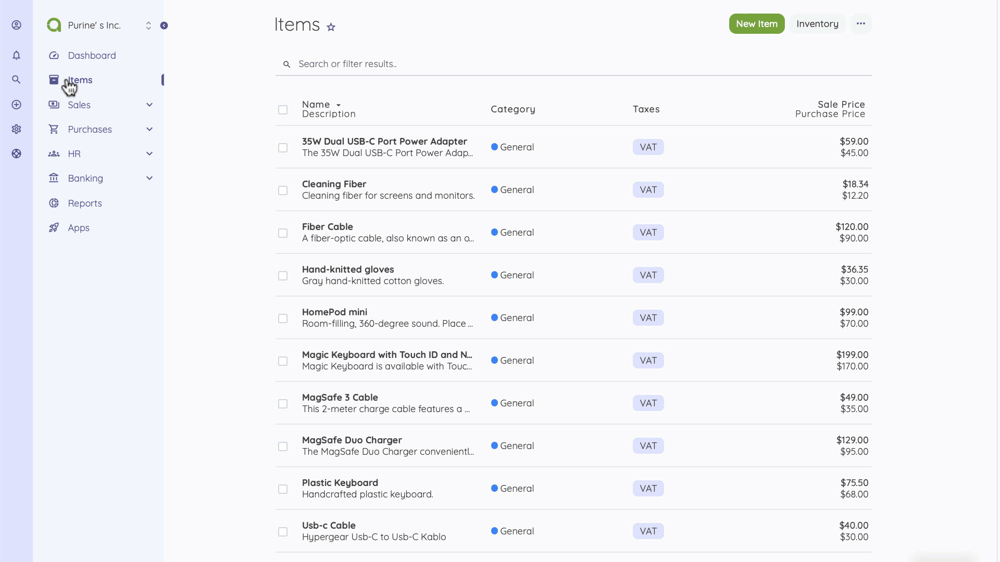

Items
=========

Items are the goods or services that your business offers customers. Click on the Items menu to add new items from the top of the page.

When creating a new item, you get to select the type - Product or Service- and the category to make your reports detailed. The description field is helpful when creating an invoice or bill.
Under the billing section, you can enter any item's sales and purchase prices. 
The following fields are displayed for items

- Name: The name of product/service.
- Type: Service or Product.
- Category: Selecting a category helps when analyzing the performance of items.
- Sale Price: This price will be used on invoices.
- Purchase Price: This price will be used on bills.

If you want a comprehensive monitor of the Status and performance of your products, you can try the [Inventory](https://akaunting.com/apps/inventory) app. 

Let's try sending invoices to customers.