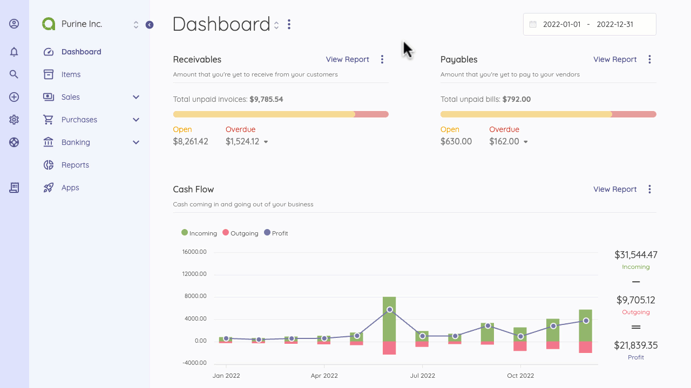
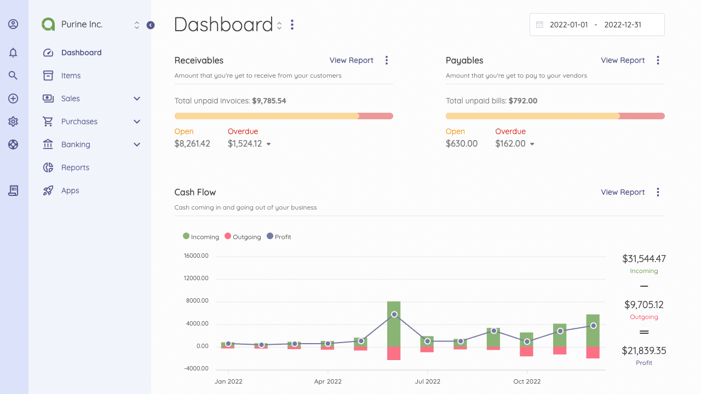

Create New Organization
=========

On the top left, you'll see the name of your company. You can set up new companies by clicking on the name. You get a dropdown with two menu options:

- **Your company name**: Clicking on this takes you to your accounting dashboard.
- **Manage Companies**: Clicking on this takes you to where you can set up a new company or edit an existing company.

Personalize the Interface
=========

You can personalize the Akaunting user interface to your company's needs. The White Label app allows you to change the primary color applied to the interface, the favicon in your browser, the background, and the logo of the login page.

[Get the White label app](https://akaunting.com/apps/white-label)  for further personalization.

Now you've personalized your Akaunting, let's learn about the Akaunting dashboard. 

